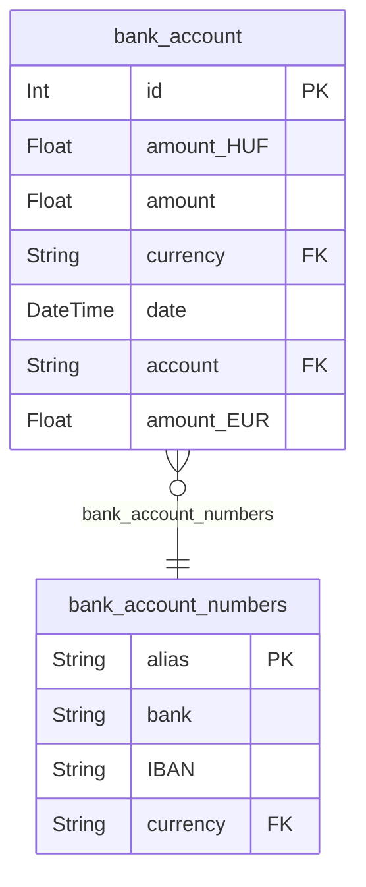
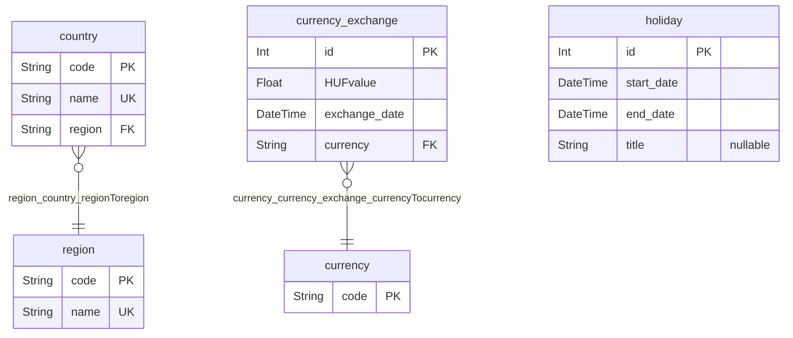
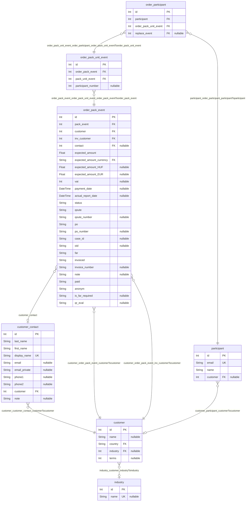
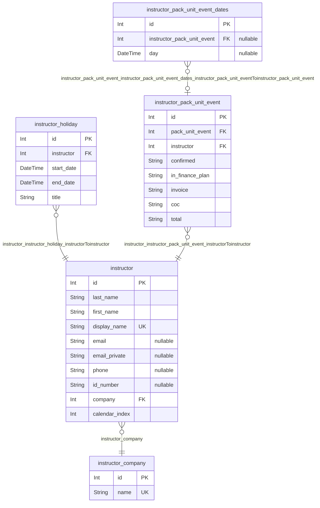
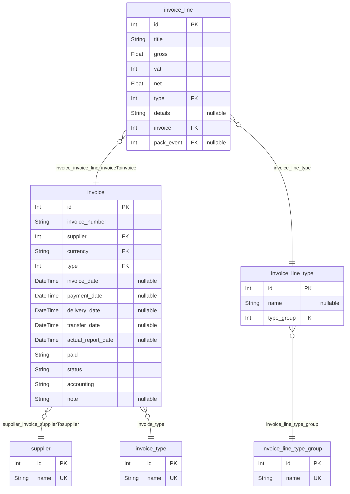
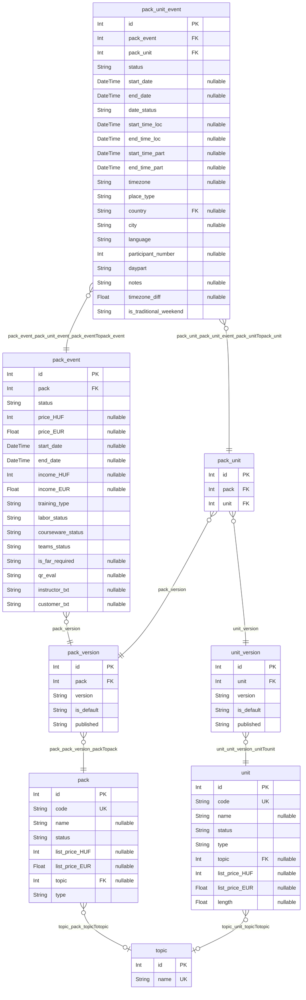

# DOCS
> Generated by [`prisma-markdown`](https://github.com/samchon/prisma-markdown)

- [Banking](#banking)
- [General](#general)
- [Order](#order)
- [Instructor](#instructor)
- [Invoice](#invoice)
- [Services](#services)

## Banking

### `bank_account`
Banki fiókok egy adott időpontokban lévő állapota

Power BI reportok és kimutatások készítéséhez szükséges adatok

**Properties**
  - `id`: Elsődleges kulcs
  - `amount_HUF`: A bank számla egyenlege forintban  
  - `amount`: A bank számla egyenlege a `currency` valutában
  - `currency`
    > A számla valutája
    > 
    > A [currency](#currency) tábla [code](#code) oszlopában felsoorolt valuták közül
  - `date`: A számla egyenlegéhez tartozó időpont
  - `account`: A számla azonosítója
  - `amount_EUR`: A számla egyenlege euróban

### `bank_account_numbers`
Banki fiókok

Power BI reportok és kimutatások készítéséhez szükséges adatok

**Properties**
  - `alias`
    > Elsődleges kulcs
    > 
    > A számla azonosítója
  - `bank`: A számlát vezető bank neve
  - `IBAN`: A számlához tartozó IBAN szám
  - `currency`: A számla valutája

## General

### `country`
Országok

**Properties**
  - `code`
    > Elsődleges kulcs
    > 
    > Ország kódja
  - `name`: Ország neve
  - `region`: Ország régiója

### `currency`
Elfogadott Valuták

**Properties**
  - `code`
    > Elsődleges kulcs
    > 
    > Valuta kódja

### `currency_exchange`
Valuta árfolyamok az adott időpontban (Cache)

**Properties**
  - `id`: Elsődleges kulcs
  - `HUFvalue`: Egységnyi valuta értéke forintban
  - `exchange_date`: Az árfolyam érvényessége 
  - `currency`: Az árfolyam valutája

### `holiday`
Cég szintű szabadságok

**Properties**
  - `id`: Elsődleges kulcs
  - `start_date`: Szabadság kezdete
  - `end_date`: Szabadság vége
  - `title`: Szabadság megnevezése

### `region`
Régiók

**Properties**
  - `code`
    > Elsődleges kulcs
    > 
    > A régió kódja
  - `name`: A régió neve

## Order

### `customer`
Ügyfelek

A képzési rendszerben szereplő ügyfelek / cégek adatai

**Properties**
  - `id`: Elsődleges kulcs
  - `name`: Ügyfél neve
  - `country`: Ügyfél országa / székhelye
  - `industry`
    > Az ügyfél tevékenységi köre
    > 
    > Meghatározza, hogy milyen iparágban tevékenykedik az ügyfél a [industry.id](#industry) táblában szereplő iparágak közül
  - `terms`: Fizetési határidő

### `customer_contact`
Kapcsolattartók

**Properties**
  - `id`: Elsődleges kulcs
  - `last_name`: Kapcsolattartó vezetékneve
  - `first_name`: Kapcsolattartó keresztneve
  - `display_name`: Kapcsolattartó neve
  - `email`: Kapcsolattartó (publikus) email címe
  - `email_private`: Kapcsolattartó (privát) email címe
  - `phone1`: Kapcsolattartó telefonszáma
  - `phone2`: Kapcsolattartó másodlagos telefonszáma
  - `customer`: A kapcsolattaró munkahelye
  - `note`: Egyéb megjegyzés

### `industry`
Ügyfelek tevékenységi köre

**Properties**
  - `id`: Elsődleges kulcs
  - `name`: Az iparág neve

### `order_pack_event`
Adott projekthez tartozó megrendelések

**Properties**
  - `id`: Elsődleges kulcs
  - `pack_event`: A projekt azonosítója
  - `customer`: 
  - `inv_customer`: A számlázandó cég azonosítója
  - `contact`: Az ügyfél kapcsolattartójának azonosítója
  - `expected_amount`
    > A megrendelésből származó várható összeg
    > 
    > A várható összeg a `expected_amount_currency` valutában van megadva
  - `expected_amount_currency`: A várható összeg valutája
  - `expected_amount_HUF`: A várható összeg áttszámolva forintba
  - `expected_amount_EUR`: A várható összeg áttszámolva euróba
  - `vat`: ÁFA mértéke
  - `payment_date`: Kifizetési időpontja
  - `actual_report_date`: Rendelés időpontja (Kimutatásokhoz)
  - `status`
    > A rendelés státusza
    > 
    > A megrendelés lehet:
    > - Tervezett LEAD
    > - Informális INFOR
    > - Megrendelt OR
    > - Befejezett FIN
    > - Törölt CA
  - `qoute`: Van e hozzá kapcsolódó ajánlat
  - `qoute_number`: Árajánlat
  - `po`: PO státusza
  - `po_number`: PO száma
  - `case_id`: Case száma
  - `oid`: Offer száma
  - `far`: FAR státusza
  - `invoiced`: számlázás státusza
  - `invoice_number`: Számla száma
  - `note`: Megjegyzés
  - `paid`: Kifizetés státusza
  - `anonym`: Adott-e a résztvevők email címe
  - `is_far_required`: FAR szükséges-e
  - `qr_eval`: QR

### `order_pack_unit_event`
Egy projekthez tartozó megrendelési tétel

A megrendelt tétel a projekt kurzusának egy részletét jelenti
Például egy Kubernetes kurzus egy rész egy Docker bevezető képzés

**Properties**
  - `id`: Elsődleges kulcs
  - `order_pack_event`: A megrendelés azonosítója
  - `pack_unit_event`: A megrendelt tétel azonosítója
  - `participant_number`: A megrendelében szereplő résztvevők száma

### `order_participant`
A megrendelésben szereplő résztvevők

**Properties**
  - `id`: Elsődleges kulcs
  - `participant`: Résztvevő azonosítója
  - `order_pack_unit_event`: A megrendelt tétel azonosítója
  - `replace_event`
    > Csere esemény azonosítója
    > 
    > Amennyiben a résztvevő nem tud részt venni a kurzuson, akkor a csere esemény azonosítója kerül ide

### `participant`
Ügyfelek

**Properties**
  - `id`: Elsődleges kulcs
  - `email`: Az ügyfél email címe (Ide kapják meg a kurzus információkat és az írott tananyagot)
  - `name`: Az ügyfél neve
  - `customer`: Az ügyfél jelenlegi cégének azonosítója

## Instructor

### `instructor`
Oktatók

**Properties**
  - `id`: Elsődleges kulcs
  - `last_name`: Oktató vezetékneve
  - `first_name`: Oktató keresztneve
  - `display_name`: Oktató neve
  - `email`: Oktató (publikus) email címe
  - `email_private`: Oktató (privát) email címe
  - `phone`: Oktató telefonszáma
  - `id_number`: Oktató személyi igazolvány száma
  - `company`: Az oktató cégének azonosítója
  - `calendar_index`: Az oktató sorszáma a Naptárban

### `instructor_company`
Oktatók cégének adatai

**Properties**
  - `id`: Elsődleges kulcs
  - `name`: Cég neve

### `instructor_holiday`
Oktatók tervezett szabadságai

**Properties**
  - `id`: Elsődleges kulcs
  - `instructor`: Oktató azonosítója
  - `start_date`: Szabadság kezdete
  - `end_date`: Szabadság vége
  - `title`: Szabadság megnevezése

### `instructor_pack_unit_event`
Oktatók rendelései

Az oktató által tartott megrendelésekhez az oktatóhoz tartozó adatok

**Properties**
  - `id`: Elsődleges kulcs
  - `pack_unit_event`: Egy projeckt egy kurzusának azonosítója
  - `instructor`: Az oktató azonosítója
  - `confirmed`: Az oktató visszaigazolta-e a rendelést
  - `in_finance_plan`: Az oktatásért kapott díj fel van-e számolva
  - `invoice`: Az oktatásért kapott díj számlázva van-e 
  - `coc`: Az oktatásért kapott díj teljesítve van-e
  - `total`: Az oktató a kurzus teljes időtartama alatt részt vesz-e

### `instructor_pack_unit_event_dates`
Oktatók rendelésének időpontjai

Amennyiben oktató nem a teljes időtartamra vesz részt egy kurzuson, akkor az időpontokat itt rögzítjük

**Properties**
  - `id`: Elsődleges kulcs
  - `instructor_pack_unit_event`: Az oktató megrendelésének azonosítója
  - `day`: A kurzus egy napja melyen az oktató részt vesz

## Invoice

### `invoice`
Számlák

**Properties**
  - `id`: Elsődleges kulcs
  - `invoice_number`: Számla száma
  - `supplier`: A számla kiállítójának azonosítója
  - `currency`: A számla valutája
  - `type`: Számla típusának azonosítója
  - `invoice_date`: Számlázás dátuma
  - `payment_date`: Kifizetés dátuma
  - `delivery_date`: Beérkezés dátuma
  - `transfer_date`: Átutalás dátuma
  - `actual_report_date`: TODO(Kristofy): Pontosítani
  - `paid`: Kifizetés státusza
  - `status`: Számla státusza (valós, tervezett)
  - `accounting`: Könyvelt vagy sem
  - `note`: Megjegyzés

### `invoice_line`
Számla sorok

A számla sorok a számlákhoz tartozó tételek

**Properties**
  - `id`: Elsődleges kulcs
  - `title`: A tétel megnevezése
  - `gross`: Bruttó összeg
  - `vat`: ÁFA (százalékban)
  - `net`: Nettó összeg
  - `type`: Tétel típusának azonosítója
  - `details`: Egyéb részletek
  - `invoice`: A számla azonosítója
  - `pack_event`: A Projekt azonosítója

### `invoice_line_type`
Számla tétel típusok

**Properties**
  - `id`: Elsődleges kulcs
  - `name`: Tétel megnevezése
  - `type_group`: Tétel csoportja

### `invoice_line_type_group`
Számla tétel csoportok

**Properties**
  - `id`: Elsődleges kulcs
  - `name`: Csoport megnevezése

### `invoice_type`
Számla típusok

**Properties**
  - `id`: Elsődleges kulcs
  - `name`: Típus megnevezése

### `supplier`
A számlát kiállító entitások

**Properties**
  - `id`: Elsődleges kulcs
  - `name`: A számla kiállítójának neve

## Services

### `pack`
Csomag

Egy csomag egy kurzus amely több modulból / képzésből áll

**Properties**
  - `id`: Elsődleges kulcs
  - `code`: A csomag kódja
  - `name`: A csomag neve
  - `status`
    > A csomag státusza
    > 
    > A csomag lehet:
    > - Aktív A
    > - Inaktív I
  - `list_price_HUF`: A csomag lista ára forintban
  - `list_price_EUR`: A csomag lista ára euróban
  - `topic`
    > A csomag téma azonosítója
    > 
    > A csomag témája a [topic.id](#topic) táblában szereplő témák közül kerül ki
  - `type`
    > A csomag típusa
    > 
    > A csomag lehet:
    > - Képzés T
    > - Szupport S
    > - Konzultáció C

### `pack_event`
Projekt

Egy meghirdetett, megrendelhető kurzus

**Properties**
  - `id`: Elsődleges kulcs
  - `pack`: A Kurzus azonosítója
  - `status`
    > A Projekt státusza
    > 
    > A projekt lehet:
    > - folyamatban PR
    > - befejezett CL
    > - törölt CA
  - `price_HUF`: A projekt ára forintban
  - `price_EUR`: A projekt ára euróban
  - `start_date`: A projekt kezdő dátuma
  - `end_date`: A projekt befejező dátuma
  - `income_HUF`: A projektből származó bevétel forintban
  - `income_EUR`: A projektből származó bevétel euróban
  - `training_type`
    > A projekt típusa
    > 
    > A projekt lehet:
    > - Mindenki számára nyílt képzés OPEN
    > - Zárt csoportos képzés CL
    > - Csak az írott tananyagot tartalmazó képzés CW
  - `labor_status`: Az automatikus laborkörnyezet kiépítésének státusza
  - `courseware_status`: Az automatikus tananyag kiküldés státusza
  - `teams_status`: Az automatikus teams csoportok létrehozása és felvételek státusza
  - `is_far_required`: FAR szükséges-e
  - `qr_eval`: QR
  - `instructor_txt`
    > Az oktató neve
    > 
    > Több oktató esetén "Több oktató"
  - `customer_txt`
    > A megrendelő cég neve
    > 
    > Több cég esetén "Több cég"

### `pack_unit`
Csomagok felépítése

Megadja, hogy egy csomag melyik kurzusokból áll

**Properties**
  - `id`: Elsődleges kulcs
  - `pack`: A csomag megfelelő verziójának azonosítója
  - `unit`: A modul megfelelő verziójának azonosítója

### `pack_unit_event`
Egy projekthez tartozó modul

**Properties**
  - `id`: Elsődleges kulcs
  - `pack_event`: A Projekt azonosítója
  - `pack_unit`: A Csomag és a modul azonosítója
  - `status`
    > A modul státusza
    > 
    > A modul lehet:
    > - folyamatban PR
    > - befejezett CL
    > - törölt CA
  - `start_date`: A modul kezdő dátuma
  - `end_date`: A modul befejező dátuma
  - `date_status`
    > Az időpont státusza
    > 
    > Az időpont lehet:
    > - hiányzó M
    > - tervezett P
    > - fix F
  - `start_time_loc`: A modul kezdő időpontja lokális idő szerint
  - `end_time_loc`: A modul befejező időpontja lokális idő szerint
  - `start_time_part`: A modul kezdete az adott napokon HH:MM
  - `end_time_part`: A modul vége az adott napokon HH:MM
  - `timezone`
    > A modul időzónája
    > 
    > Az oktatás ehhez az időzónához igazodik
  - `place_type`
    > A helyszín típusa
    > 
    > A helyszín lehet:
    > - Online On
    > - Az oktató cégnél Com
    > - Ügyfélnél Cu
  - `country`: Az oktatás országa (ha az oktatás helyszíne az ügyfél cégénél van)
  - `city`: Az oktatás városa (ha az oktatás helyszíne az ügyfél cégénél van)
  - `language`: Az oktatás nyelve
  - `participant_number`: Az oktatásra jelentkezett résztvevők száma
  - `daypart`: Félnapos oktatás esetén a naprész (AM, PM, FULL)
  - `notes`: Megjegyzések
  - `timezone_diff`: Az időzóna különbsége a magyar időzónához képest
  - `is_traditional_weekend`: Az oktatandó ügyfelek a Szombat - Vasárnapot tekintik hétvégeknek

### `pack_version`
Csomagok verziói

Egy csomagnak létehzet több verziója
Ezekhez különböző laborkörnyezet és tananyag is tartozhat

**Properties**
  - `id`: Elsődleges kulcs
  - `pack`: A csomag azonosítója
  - `version`: A csomag verziója
  - `is_default`
    > Az alapértelmezett verzió
    > 
    > Amennyiben több verzió is létezik, akkor az alapértelmezett verzió az amelyiket ajánljuk, az újabb projekteket tipikusan ezzel a verzióval hozzuk létre
  - `published`: publikálva van-e, ha nem akkor vagy megszűnt vagy fejlesztés alatt van

### `topic`
Képzési témák

**Properties**
  - `id`: Elsődleges kulcs
  - `name`: A téma megnevezése

### `unit`
Modulok

Egy modul egy önmagában is oktatható képzési egység

**Properties**
  - `id`: Elsődleges kulcs
  - `code`: A modul kódja
  - `name`: A modul neve
  - `status`
    > A modul státusza
    > 
    > A modul lehet:
    > - Aktív A
    > - Inaktív I
  - `type`
    > A modul típusa
    > 
    > A modul lehet:
    > - Képzés T
    > - Szupport S
    > - Konzultáció C
  - `topic`
    > A modul témája
    > 
    > A modul témája a [topic.id](#topic) táblában szereplő témák közül kerül ki
  - `list_price_HUF`: A modul lista ára forintban
  - `list_price_EUR`: A modul lista ára euróban
  - `length`: A modul időtartama (napokban)

### `unit_version`
Modulok verziói

Egy modulnak létezhet több verziója
Ezekhez különböző laborkörnyezet és tananyag is tartozhat

**Properties**
  - `id`: Elsődleges kulcs
  - `unit`: A modul azonosítója
  - `version`: A modul verziója
  - `is_default`
    > Az alapértelmezett verzió 
    > 
    > Amennyiben több verzió is létezik, akkor az alapértelmezett verzió az amelyiket ajánljuk, az újabb projekteket tipikusan ezzel a verzióval hozzuk létre
  - `published`: publikálva van-e, ha nem akkor vagy megszűnt vagy fejlesztés alatt van