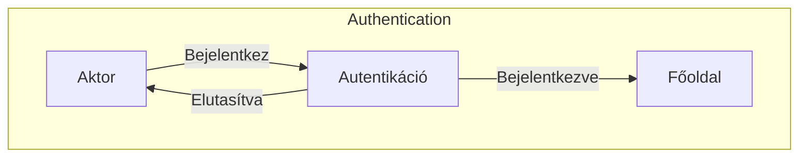
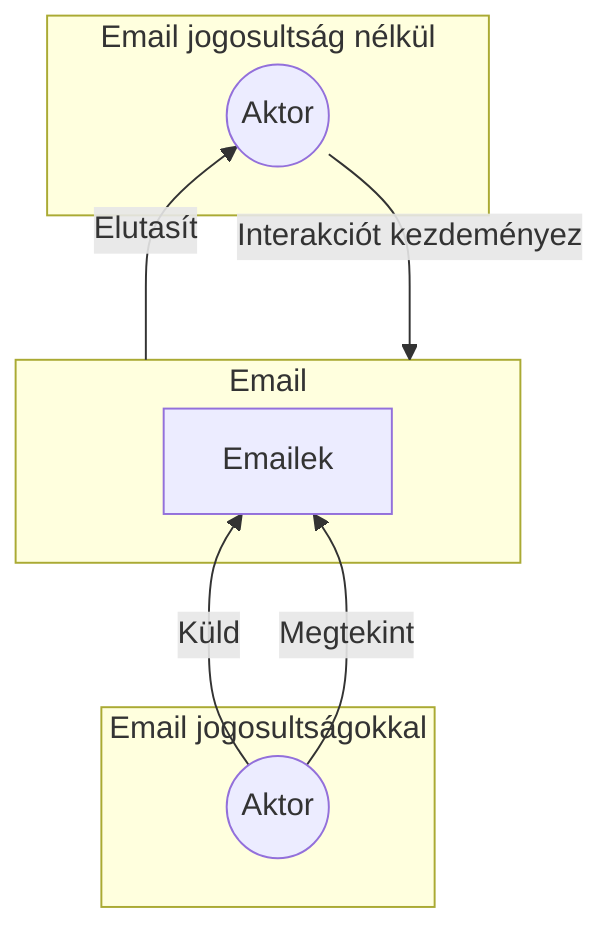
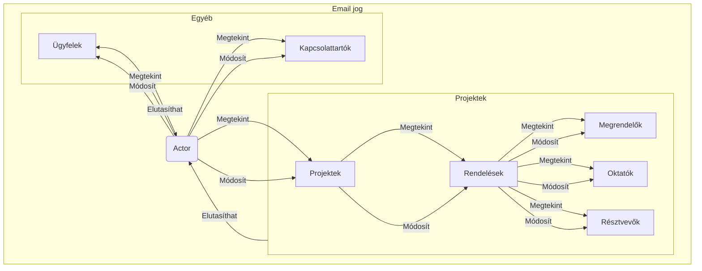
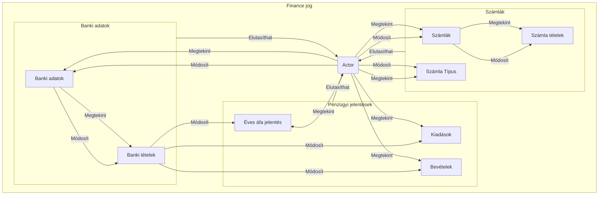
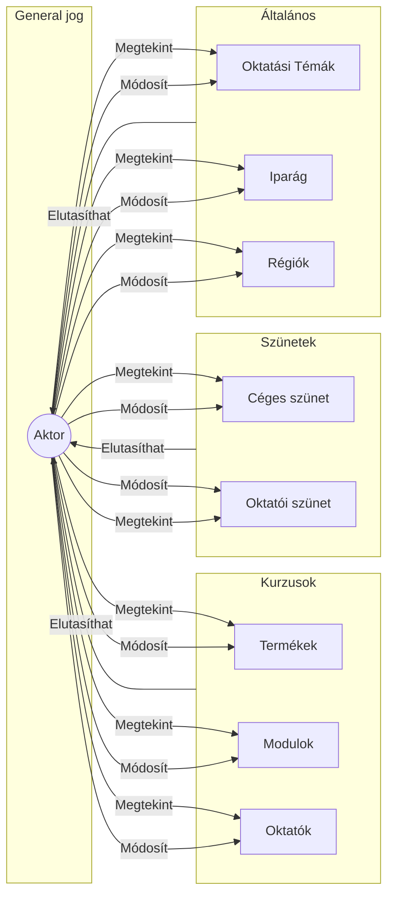
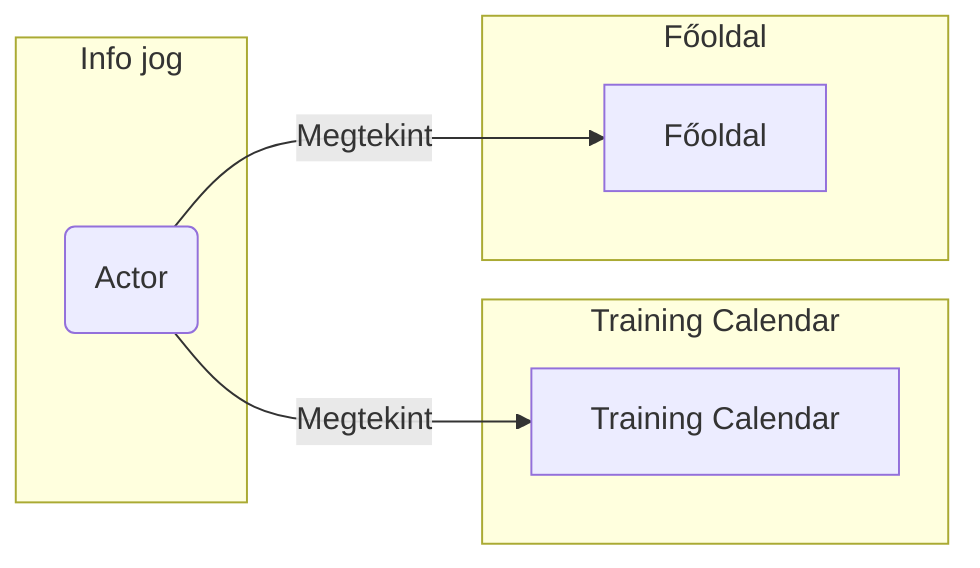

#### 3.3.3.1 As An **Un Authenticated User**. 
\
Bejelentkezési oldal látogatásakkor a felhasználó, ha még nem jelentkezett be, akkor a bejelentkezési oldalra irányítódik át, ahonnan sikeres bejelentkezés után a főoldalra irányítódik át, sikeretelen bejelentkezés esetén a bejelentkezési oldalon marad.

\pagebreak

#### 3.3.3.2 As An **Authenticated User** With **Email** privileges.

\

Amennyiben egy felhasználó rendelkezik az email(W) jogosultsággal akkor az alábbi funkciókat tudja elérni:  

- Küldhet emailt  

- Megtekintheti az emailküldés státuszát  

Ha csak olvasó jogosultsága van akkor csak megtekintésre nyithatja meg, amennyiben nincs jogosultsága, akkor nem tudja megnyitni az oldalt, a menüfülön nem is lesz látható az opció.

\pagebreak

#### 3.3.3.3 As An **Authenticated User** With **Order** privileges.
\
A felhasználó meg tudja tekinteni a futó projektekt és annak minden részletét beleértve a megrenelőket és a megrendelők résztvevőit, valamit a projektet tartó oktatókat. Ezen felül képes az ügyfeleket és kapcsolattartók adatait módosíttani.

- Módosíttás csak akkor ha van W jogosultsága

- Megtekintés csak akkor ha Olvasás(vagy írás) jogosultsága van.

- Ha nincs jogosultsága akkor nem tudja megnyitni az oldalt, a menüfülön nem is lesz látható az opció, ha a felhasználó mégis oda navigál akkor az oldal elutasítja a kérést.

\pagebreak

#### 3.3.3.4 As An **Authenticated User** With **Finance** privileges.
\
A felhasználó hozzáfér a pénzügyi adatokhoz és azokat módosíthatja is.  
A pézügyi adatok közé tartozik a költségek, bevételek, banki adatok, számlák és számla tételek, valamint az áfa jelentések.  

- Módosíttás csak akkor ha van W jogosultsága

- Megtekintés csak akkor ha Olvasás(vagy írás) jogosultsága van.

- Ha nincs jogosultsága akkor nem tudja megnyitni az oldalt, a menüfülön nem is lesz látható az opció, ha a felhasználó mégis oda navigál akkor az oldal elutasítja a kérést.

\pagebreak

#### 3.3.3.5 As An **Authenticated User** With **General** privileges.
\
A felhasználó hozzáfér az általános adatokhoz.  
Az általános adatok közé tartozik a modulok, termékek, oktatók, céges szünetek, oktatási témák, iparágak és régiók.  

- Módosíttás csak akkor ha van W jogosultsága

- Megtekintés csak akkor ha Olvasás(vagy írás) jogosultsága van.

- Ha nincs jogosultsága akkor nem tudja megnyitni az oldalt, a menüfülön nem is lesz látható az opció, ha a felhasználó mégis oda navigál akkor az oldal elutasítja a kérést.

\pagebreak

#### As An **Authenticated User** With **Info** privileges.
\
Minden felhasználó rendelkezik az Info jogosultsággal.  

Az Info jogosultság csak megtekintésre jogosítja fel a felhasználót.  

A Felhasználó megtekintheti a Training Calendár és a Főoldalon a közeljövőben esedékes eseményeket.  

