# Szakdolgozat


EÖTVÖS LORÁND TUDOMÁNYEGYETEM
Informatikai Kar
Média- és Oktatás informatikai Tanszék

CompOffice - Kurzus és pénzügyi adminisztárció

Témavezető: Dr. Menyhárt László Gábor, egyetemi adjunktus

Szerző: Osztopáni Kristóf, Programtervező informatikus BSC

\pagebreak

# 1. Bevezetés

## 1.1 A dolgozat felépítése

A Szakdolgozat több szekcióra van osztva. Ezeket a címekben és alcímekben megjelenő első szám jelöli.

A szakdolgozat megírása még folymatban van, így egyes részek hiányosak lehetnek.

Egyes szekciók tartalma:

- **1. Bevezetés**: Bemutatom a tervezett alkalmazást nagy vonalakban, szakdolgozat feléptését, az alkalmazás célközönségét valamint a szakdolgozat motivációját.

- **2. Felhasználói dokumentáció**: Az alkalmazás használatát mutatom be, a felhasználói felületet, a menüpontokat, az alkalmazás használatának lépéseit.

- **3. Fejlesztői dokumentáció**: Az alkalmazás fejlesztésének lépéseit mutatom be, a fejlesztés során használt technológiákat, a fejlesztési környezetet, a fejlesztési lépéseket valamint a kész arhitketúrát.

## 1.2 Témabejelentő

> Megjegyzés: A témabejelentőm, nem a szószerinti leadott verzió, de tartalmilag ekvivales

A szakdolgozatom témája egy fullstack alkalmazás fejlesztése, amely egy cég belső adminisztrációját segíti, továbbá a fejlesztést és későbbi támogatást segíttő technológiák felhasználása.

Az alkalmazás célja, hogy gyorsítsa az adminisztrációs folyamatokat, valamint a pénzügyi adatok kezelését. Ezek a folyamatok:

- A modulok(A legkissebb önmagukban is értékesíthető kurzusok) regisztrálása
- A termékek(Több modult tartalmazhat) registrálása
- Projektek (Egy kurzus amit adott időpontban tartunk és megrendelhető) regisztrálása
- A projektekre érkező rendelések céges információinak / részvevők adatainak / a kurzust tartó oktatók adataink rögzíttése, ellenőrzése
- A projektekhez tartozó pénzügyi adatok kezelése
- Általános pénzügyi adatok kezelése

Az alkalmazás érzékeny adatokat kezel így a biztonságra nagy hangsúlyt fektetek. Az alkalmazásban a Microsoft MFA autentikáció és Azure AD alapján a teljes céges okoszisztémában is használt biztonságos bejelentkezés lesz jelen. A biztonság elvárások miatt kiemelten fontos a hogy a lehető legkevesebb bug jusson csak ki a kódbázisból a kész termékbe. Ehhez teljes e2e típusbiztos rendszert alakíttunk ki, ami azt jelenti hogy a kommunikáció az Adatbázistól a szerverhez és a szervertől a klienshez végig típusellenőrízve lehet, amely reményeim szerint csökkenti az előforduló hibák számát. Továbbá a célom egy olyan tesztelési keretrendszer felépíttése amely képes a teljes kódbázist a funkcionális követelmények alapján tesztelni.

Az alkalmazás fejlesztéséhez sok automatikus rendszer is tartozik, a fejelsztői élmény növelése érdekében. Ezeket a fejlesztői dokumentációban részletesen is bemutatom.

A felhasználók számára elérhető lesz egy kalendár és egy dashboard, ahol a tervezet és elműlt megrendeléseket követhetik nyomon, valamint küldhetnek ki emlékezdtetőket és összefoglalókat az oktatóknak az elkövetkező kurzusokról.
Továbbá egy automatikus rendszer emlékezteti az adminisztrátorokat a közelgő eseményekről, hiányzó bejegyzésekről.

Az alkalmazás egy fullstack PWA lesz, amely ahol a szerver és kliens oldalt én valósíttom meg, az adatbázis pedig egy már létező adatbázisra épül, így ennek módosíttása nem része a dolgozatomnak.

Ezt az alkalmazást 3 éve egy LowCode keretrendszerben már megvalósítottam, de ez a megoldés nem volt skálázható, így most egy teljesen új megközelítéssel szeretném megvalósítani.

\pagebreak

# 3. Fejlesztői Dokumentáció

## 3.1 Áttekintés

### 3.1.1 Élő dokumentáció

A dokumentáció nagy része "élő" dokumentációként lett tervezve, ígya dokumentáció nagy része integrált a kódbázisban.

Erre egy példa hogy az adatbázis modelje a `prisma/schema.prisma` file amely leírja a konkrét adatbázis táblákat és kapcsolatokat, képes legenerálni a hozzájuk tartozó entity-relationship diagramot és leírásokat is.

> Megjegyzés: A dokumentáció így "élő" hiszen csak a kód részét kell változtatnom és emiatt frissül a dokumentáció része is a projektnek.

A schema így néz ki:

```
/// @namespace Instructor
/// Oktatók cégének adatai
model instructor_company {
/// Elsődleges kulcs
///
/// @format uuid
id         Int          @id(map: "PK__instruct__3213E83FA0B8D54C")

/// Cég neve
name       String       @unique(map: "UQ__instruct__72E12F1BD9C014F0") @db.VarChar(100)
instructor instructor[]
}
```

És ebből Markdown formátumú dokumentáció készül. A kódbázis minden dokumentációja Markdown formátumú, pontosabban Github Favoured Markdown formátumú, és elérhető a [githubon](https://github.com/Kristofy/CompOffice/blob/master/wiki/wiki.md). Ebből PDF is generálható.

### 3.1.2 Dokumentáció előállítása

A dokumentációs fájlok:

- **/wiki/**: Tartalmazza az öszes dokumentációt.
- **/wiki/wiki.md/**: Az összevont dokumentáció
- **/wiki/docs.md**: A dokumentáció kialakításához használt gyökér fájl.
- **/wiki/dev/**: Tartalmazza a dokumentáció élő részét, ezek a generált dokumentációk.
- **/wiki/content/**: Tartalmazza a dokumentáció statikus részét

A Dokumentáció felépíttése a kódbázisból a következőként történik:

- **1.**: Az adatbázis dokumentációjának legenerálása
- **2.**: A userstory-k dokumentációjának legenerálása
- **3.**: A root fájlt használva egy md-be összevonja a dokumentáció részeit.
- **4.**: Az összevont dokumentációból készítjük a PDF-et.

> A megfelelő környezetben az `npm run docs` parancs ezeket hajtja végre

### 3.1.3 A használt eszközök

- Az adatbázis-t [Prisma](https://www.prisma.io/) Orm-el managelem, és ehhez egy (prisma-markdow)[https://github.com/samchon/prisma-markdown] generátorral készítem a dokumentációt.

- A markdown dokumentációban található [Mermaid](https://github.com/mermaid-js/mermaid) formátumú diagrammokat a [mermaid-filter](https://github.com/raghur/mermaid-filter) cseréli le képre pdf esetén.

- A md-merge-lés egy saját python eszköz amely megtalálható a `/tools/md_merge.py` fileban

- A user-story-k a '/features` mappában találhatóak .feature kiterjesztéssel, ezek egy speciális Markdown formátumot követnek kifejezetten User-story-kra tervezve, a formátumot (Gherkin)[https://cucumber.io/docs/gherkin/reference/]-nek hívják.

- A .features kiterjesztésű user story-k közönséges Markdown-ná alakíttását a [gherkin2markdown](https://github.com/raviqqe/gherkin2markdown) program végzi.

- A végső PDF a [Pandoc](https://pandoc.org/) programmal készül az [eisvogel](https://github.com/enhuiz/eisvogel) template-t használva.

\pagebreak

## 3.2 Nem funkcionális követelmények

### 3.2.1 Hatékonyság

- A gyors válaszidő fontos, de nem priorítás.

- Az alkalmazás ahol tehet nagy mennyiségű adatokat pager-rel jeleníttmeg

- Az adat módisíttás optimisztikus módon történik, azaz ha a kliens oldalon el lett fogadva akkor a kliens folytatja a működésést még mielőtt a szerver válaszolna, a ritka alkalmankét amikor a szerver válasza, hogy helytelen a kliens oldali változás akkor a kliens oldalán is visszaállítja a változást.

- Ammenyiben szükséges egy Gyorsítóttár réteg is bevezethető, az adatbázis tűlterheltségének csökkentésére. Feltehetően mivel az alkalmazást egyszerre csak 5-10 ember használja, ezért nem lesz szükség rá.

### 3.2.2 Biztonság

- Minden kommunikáció MS MFA Azure AD mögött történik.

- Az ismert támadási technikák (SQL Injection, XSS, stb.) nem működnek az alkalmazásban.

### 3.2.3 Megbízhatóság

- Az alkalmazás tRPC-t használ a kliens oldalon, de REST stílusú "publikus" api-t is biztosítt. nem vezethet hibás viselkedéshez.

- Minden fontos esemény az alkalmazásban naplózásra kerül.

### 3.2.4 Felhasználói felület

- A felület ergonomikus és könnyen kezelhető.

- A felület kényelmes új felhasználók számára és lehetőséget ad a gyorsabb munkára a tapasztalt felhasználók számára.

- Az alkalmazásnak reszponzívnak kell lennie, azaz minden eszközön jól használhatónak kell lennie, habár az alkalmazás irodai környezetben való munkára (Számítógépen) készül.

### 3.2.5 Platformfüggetlenség

- Az alkalmazás kliens oldala Chromium alapú böngészőkön és Firefoxon működik.

- A server oldal tetszőleges linux szerveren működik.

### 3.2.6 Szükséges erőforrások

**Hardveres erőforrások**:

- Az alkalmazás kliens oldala egy átlagos számítógépen is futtatható.
- Az alkalmazás szerver oldala egy átlagos szerveren is futtatható.
- Fejlesztés alatt a gyors fejlesztéshez egy erősebb számítógép ajánlott 8+ GB rammal és 4+ magos processzorral.

**Szoftveres erőforrások**:

- Az alkalmazás kliens oldala egy átlagos böngészőn futtatható.
- Az alkalmazás szerver oldala egy átlagos linux szerveren futtatható.
- Fejlesztés alatt a package.json-ben devDependencies-ben megadott szoftverek szükségesek, valamint egyéb csomagok ezek:
- git, nodejs, npm, pandoc, go, python3, texlive latex csomagok
- fejlesztői környezet, lehetőleg ami integrálja a formázó és lintelő eszközöket pl.: VSCode vagy nvim
- Adatbázis szerver

**Üzemeltetés és karbantartás**:

- Az karbantartáshoz egy naplózó rendszer beüzemelése előnyös de nem szükséges
- Az üzemeltetés a számítógép költségén kívül nem igényel egyéb költséget.
- A karbantartás egyszerűsíttése a dolgozatom egyik fő célja. Reményeim szerint az erre fordíttandó költéségek minimálisak lesznek.

### 3.2.7 Megvalósíttás és használt technológiák

TBD

\pagebreak

## 3.3 Funkcionális követelmények

A rendszernek a következő funkciókat, reakciókat kell tudnia biztosítani.

> Megjegyzés: Az alkalmazás belső használatra készül így a nyílt webről kereséssel való felfedezéssel nem kell foglalkozni.

### 3.3.1 Általános funkciók

#### A weboldal megnyitása után:

- A felhasználók bejelentkezhetnek, akkor és csak akkor ha Azure AD-ben megenedett felhasználók.
- Ha a felhasználónak még van aktív bejelentkezése, akkor nem szükséges újra bejelentkeznie.
- Egy felhasználóhoz több aktív munkamenet is tartozhat.

#### A weboldal bezárása után:

- Az aktív munkamenet lezárul.

#### A weboldal minden "oldalán":

> Megjegyzés: Az alkalmazás egy PWA tehát nem a hagyományos értelemben vett oldalakról beszélünk

- A felhasználók a menüben tudnak navigálni.
- A felhasználók vissza tudnak lépni a főoldalra.
- A felhasználók tudnak kijelentkezni.
- A felhasználók vissza tudnak lépni a jelenlegi munkamenetben a régebbi oldalra.
- A felhasználó meg tudja nyitni a kalendárt
- Minden listázó oldal frissíthető.
- Minden szerkesztő oldal menthető.
- Ha az éppen szerkesztett rekordot valaki más módosította, akkor a felhasználót értesíteni kell.

\pagebreak

### 3.3.2 Felhasználók

#### 3.3.2.1 Jogosultsági szintek

A rendszerben a következő jogosultsági szinteket különböztetjük meg:

- **Super**: Az alkalmazás teljes körű használatára jogosult, admin felhasználó.

- **Test**: Az alkalmazás teljes körű használatára jogosult, fejlesztő és tesztelő felhasználó.

- **Finance**: A cég pénzügyi adatainak kezelésére jogosult felhasználó.

- **Operator**: A cég üzemi adatainak kezelésére jogosult felhasználó.

- **Coordinator**: (Legacy) Az Operátor felhasználókkal ekvivalens jogosultságú felhasználó.

> Kezdetben különbözőek jogosultságokkal rendelkeztek de a kialakulás alatt a kért változások miatt a végeredményben ugyanazok a jogosultságokkal rendelkeznek, de különböző embereknek vannak kiosztva.

- **Instructor**: A cég egy belső oktatója, főként a felvitt project adatok ellenőrzésére jogosult.

- **Support**: A cég egy külsős oktatója, a jogosultságai az Instructor felhasználóéval jelenleg megegyeznek.

- **Bot**: Az automatikus rendszerekhez szükséges legszűkebb jogosultságú felhasználó / service account.

#### 3.3.2.2 Jogosultsági körök

Az alkalmazásban elvégezhető műveleteket a következő csoportokba lehet beosztani:

- **Email**: Az emlékeztető és értesítő levelek küldése

- **Info**: A Dashboard és a Kalendár megtekintése

- **Order**: A rendelések kezelése és új projectek kiírása

- **Finance**: A pénzügyi adatok kezelése, a banki backlogok kezelése

- **General**: Általános adatok kezelése

Ezek a csoportok tartalma megtekinthető az Adatbázis leírásában

Továbbá a jogosultságok megvalósíttásakkor a jogosultsági körök minden oldalra külön felülírhatóak lesznek.

#### 3.3.2.3 Műveletek

A jogosultsági körök által meghatározott műveletek a következők lehetnek:

- **Read**(R): Adatok megtekintése

- **Write**(W): Adatok módosítása

- **Restricted**(-): Az adott adatokhoz nincs hozzáférés

| Jogosultságok \ Körök | Super | Test | Finance | Operator | Coordinator | Instructor | Support |
| --------------------- | ----- | ---- | ------- | -------- | ----------- | ---------- | ------- |
| Email                 | W     | W    | -       | W        | W           | -          | -       |
| Info                  | W     | W    | W       | W        | W           | R          | R       |
| Order                 | W     | W    | W       | W        | W           | R          | R       |
| Finance               | W     | W    | W       | -        | -           | -          | -       |
| General               | W     | W    | W       | W        | W           | R          | R       |

#### 3.3.2.4 Vendég jogosultságok

Minden adat érzékeny így nem engedünk vendég felhasználót, kizárólag a Céges Azure AD-ban meghatározott felhasználók látogathatják az oldalt

\pagebreak

### 3.3.3 Use-case diagramok

#### 3.3.3.1 As An **Un Authenticated User**.

\
Bejelentkezési oldal látogatásakkor a felhasználó, ha még nem jelentkezett be, akkor a bejelentkezési oldalra irányítódik át, ahonnan sikeres bejelentkezés után a főoldalra irányítódik át, sikeretelen bejelentkezés esetén a bejelentkezési oldalon marad.

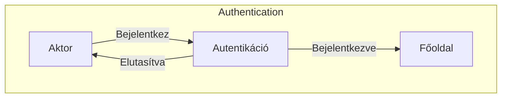

\pagebreak

#### 3.3.3.2 As An **Authenticated User** With **Email** privileges.

\

Amennyiben egy felhasználó rendelkezik az email(W) jogosultsággal akkor az alábbi funkciókat tudja elérni:

- Küldhet emailt

- Megtekintheti az emailküldés státuszát

Ha csak olvasó jogosultsága van akkor csak megtekintésre nyithatja meg, amennyiben nincs jogosultsága, akkor nem tudja megnyitni az oldalt, a menüfülön nem is lesz látható az opció.

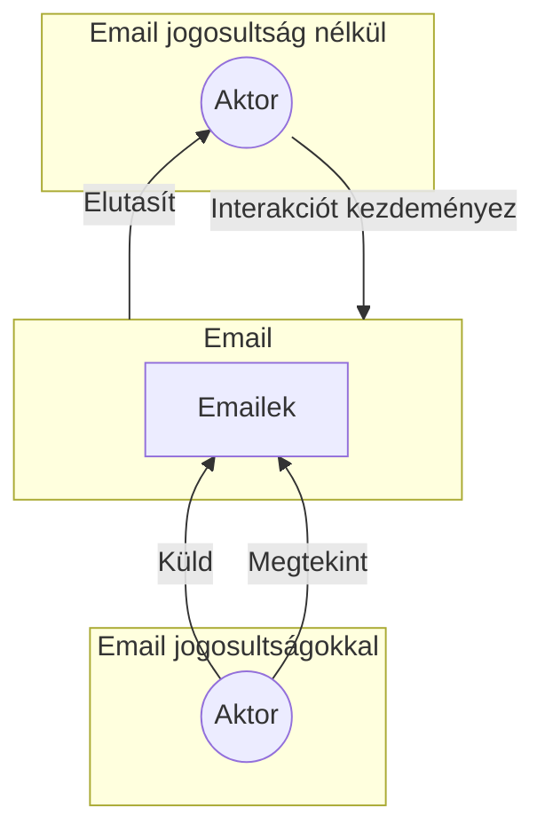

\pagebreak

#### 3.3.3.3 As An **Authenticated User** With **Order** privileges.

\
A felhasználó meg tudja tekinteni a futó projektekt és annak minden részletét beleértve a megrenelőket és a megrendelők résztvevőit, valamit a projektet tartó oktatókat. Ezen felül képes az ügyfeleket és kapcsolattartók adatait módosíttani.

- Módosíttás csak akkor ha van W jogosultsága

- Megtekintés csak akkor ha Olvasás(vagy írás) jogosultsága van.

- Ha nincs jogosultsága akkor nem tudja megnyitni az oldalt, a menüfülön nem is lesz látható az opció, ha a felhasználó mégis oda navigál akkor az oldal elutasítja a kérést.

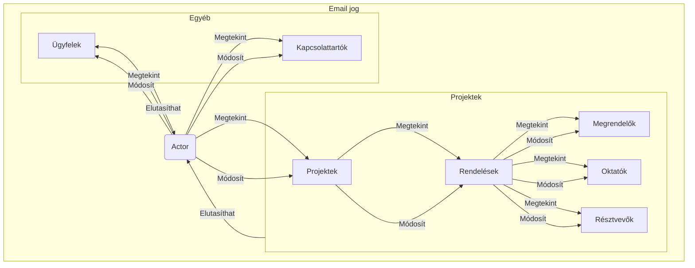

\pagebreak

#### 3.3.3.4 As An **Authenticated User** With **Finance** privileges.

\
A felhasználó hozzáfér a pénzügyi adatokhoz és azokat módosíthatja is.
A pézügyi adatok közé tartozik a költségek, bevételek, banki adatok, számlák és számla tételek, valamint az áfa jelentések.

- Módosíttás csak akkor ha van W jogosultsága

- Megtekintés csak akkor ha Olvasás(vagy írás) jogosultsága van.

- Ha nincs jogosultsága akkor nem tudja megnyitni az oldalt, a menüfülön nem is lesz látható az opció, ha a felhasználó mégis oda navigál akkor az oldal elutasítja a kérést.

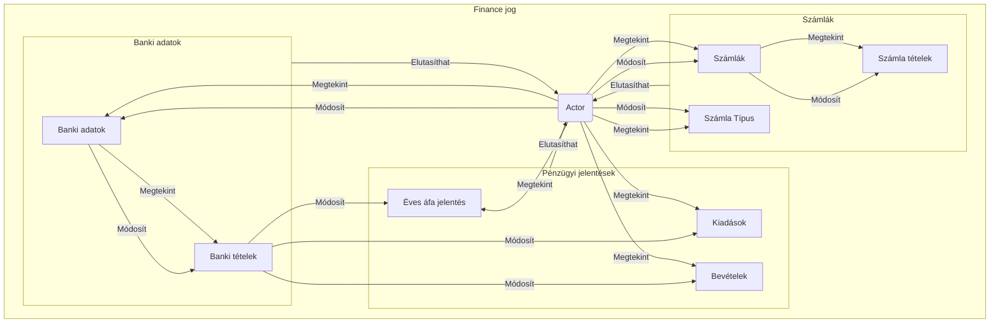

\pagebreak

#### 3.3.3.5 As An **Authenticated User** With **General** privileges.

\
A felhasználó hozzáfér az általános adatokhoz.
Az általános adatok közé tartozik a modulok, termékek, oktatók, céges szünetek, oktatási témák, iparágak és régiók.

- Módosíttás csak akkor ha van W jogosultsága

- Megtekintés csak akkor ha Olvasás(vagy írás) jogosultsága van.

- Ha nincs jogosultsága akkor nem tudja megnyitni az oldalt, a menüfülön nem is lesz látható az opció, ha a felhasználó mégis oda navigál akkor az oldal elutasítja a kérést.

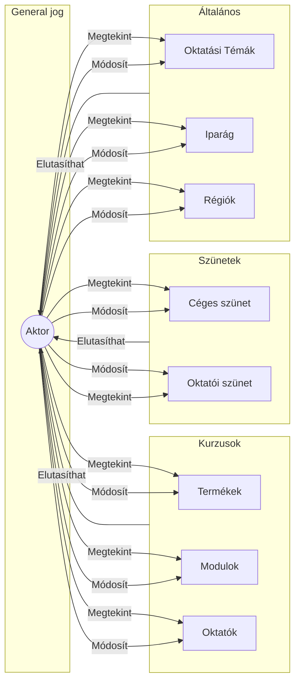

\pagebreak

#### As An **Authenticated User** With **Info** privileges.

\
Minden felhasználó rendelkezik az Info jogosultsággal.

Az Info jogosultság csak megtekintésre jogosítja fel a felhasználót.

A Felhasználó megtekintheti a Training Calendár és a Főoldalon a közeljövőben esedékes eseményeket.

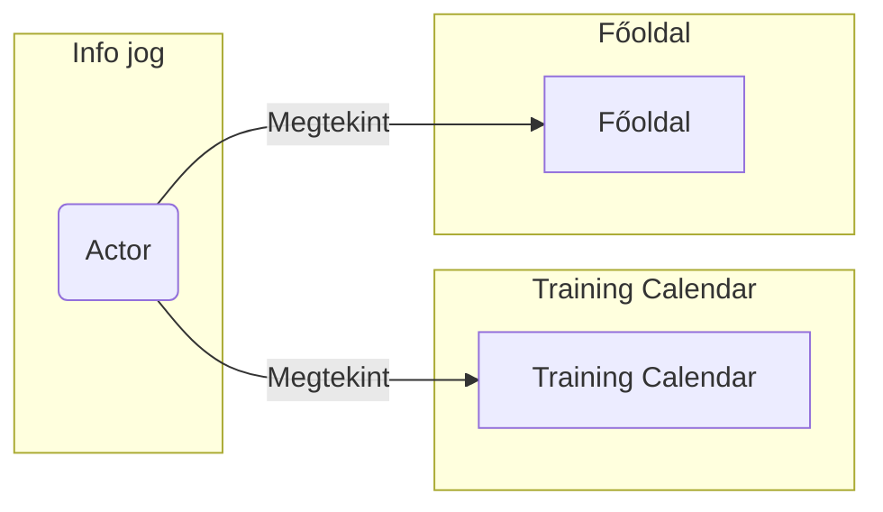

\pagebreak

### 3.3.4 User-Story-k

\footnotesize

### A felhasználó be tud lépni az alkalmazásba

#### A felhasználó bejelentkezik

_Given_ A felhasználó fiókja Azure AD-ben megengedett

_When_ Oldal látogatása

_Then_ Automatikus bejelentkeztetés.

#### A felhasználó nem jelentkezhet be

_Given_ A felhasználó fiókja Azure AD-ben nem megengedett

_When_ Oldal látogatása

_Then_ Az oldal visszautasítja a bejelentkezést.

#### A bejelentkezett felhasználó a főoldalra kerül

_Given_ A felhasználó bejelentkezett

_When_ Oldal látogatása

_Then_ A főoldalra kerül.

#### A bejelentkezett felhasználó kijelentkezik

_Given_ A felhasználó bejelentkezett

_When_ Kijelentkezés

_Then_ A bejelentkező oldalra kerül.

#### A felhasználónak megfeleő jogosultságai vannak

_Given_ A felhasználó bejelentkezett

_When_ Oldal látogatása

_Then_ A felhasználó megfelelő jogosultságokkal rendelkezik.

### Általános műveletek nem lehetségesek a megfelelő jogosultság nélkü

#### Az oldal nem tölt be adatot, és hibát ad, ha a felhasználó megfelelő jogosultság nélkül látogat egy oldalt

_Given_ A felhasználó bejelentkezett

_When_ A oldal látogatása AND A felhasználónak nincs megtekintés jogosultsága az A oldalhoz

_Then_ Az oldal nem tölt be adatot, és hibát ad.

#### Az oldalakon nem módosíthat jogosultság nélkül

_Given_ A felhasználó bejelentkezett

_When_ A oldal látogatása AND A felhasználónak nincs módosítás jogosultsága az A oldalhoz

_Then_ Az oldalakon nem módosíthat.

#### Az oldalakon nem törölhet jogosultság nélkül

_Given_ A felhasználó bejelentkezett

_When_ A oldal látogatása AND A felhasználónak nincs törlés jogosultsága az A oldalhoz

_Then_ Az oldalakon nem törölhet.

#### Az oldalakon nem hozzáadhat jogosultság nélkül

_Given_ A felhasználó bejelentkezett

_When_ A oldal látogatása AND A felhasználónak nincs hozzáadás jogosultsága az A oldalhoz

_Then_ Az oldalakon nem hozzáadhat.

#### Törlés esetén mindig mergerősíttést kérünk

_Given_ A felhasználó bejelentkezett

_When_ A törlés ikonra kattint

_Then_ Törlés esetén mindig mergerősíttést kérünk.

### Visszalépés

#### A felhasználó visszalép az előző oldalra

_Given_ A felhasználó bejelentkezett

_Given_ Egy tetszőleges A oldalt majd B oldalt meglátogatott

_When_ A felhasználó visszalép

_Then_ A felhasználó az előző A oldalra kerül.

### Projekt oldal

#### A felhasználó meglátogathatja a projekt oldalt

_Given_ A felhasználó bejelentkezett

_When_ A felhasználónak van jogosultsága megtekinteni a projekt oldalt

_Then_ A projekt oldal betölt.

#### A projekt oldalon a megfelelő adatok jelennek meg

_Given_ A projekt oldal betölt

_Then_ A Projekt oldalon a megfelelő adatok jelennek meg.

#### A törlés ikonok megfelelően működnek

_Given_ A projekt oldal betölt

_When_ felhasználónak van jogosultsága módosítani a projekt oldalon

_Then_ A törlés ikon megjelenik minden projekt mellett.

#### A törlés ikonra kattintva a projekt törlődik

_Given_ A projekt oldal betölt

_When_ felhasználó törölni próbál egy projektet

_Then_ A projekt törlődik, minden hozzá tartozó adattal együtt.

#### A felhasználónak nincs jogosultsága módosíttani a projekt oldalon

_Given_ A projekt oldal betölt

_When_ A felhasználónak nincs jogosultsága módosíttani a projekt oldalon

_Then_ A projekt oldalon törlés ikon nem jelenik meg.

#### A szűrők megfelelően működnek, üres állapotból indulnak

_Given_ A projekt oldal betölt

_Then_ A szűrők megfelelően működnek, üres állapotból indulnak.

#### Projektek kiválaszthatóak, és ezek megjelennek részletesen

_Given_ A projekt oldal betölt

_When_ A felhasználó kiválaszt egy projektet

_Then_ A projekt részletesen megjelenik.

#### Összesített oldal megfelelő adatokat jelenítt meg

_Given_ A projekt részletesen megjelenik

_When_ A felhasználó kiválasztja az összesített oldalt

_Then_ A összesített oldal megfelelő adatokat jelenítt meg.

#### Modulok oldal megfelelő adatokat jelenítt meg

_Given_ A projekt részletesen megjelenik

_When_ A felhasználó kiválasztja a modulok oldalt

_Then_ A modulok oldal megfelelő adatokat jelenítt meg.

#### A Rendelések oldal megfelelő adatokat jelenítt meg

_Given_ A projekt részletesen megjelenik

_When_ A felhasználó kiválasztja a rendelések oldalt

_Then_ A rendelések oldal megfelelő adatokat jelenítt meg.

#### A felhasználó klónoz egy projectet

_Given_ A felhasználó kiválasztja az összesített oldalt AND felhasználónak van jogosultsága módosítani a projekt oldalon

_When_ A felhasználó a klónozás ikonra kattint

_Then_ A projekt klónozása lehetséges.

#### Egységes módosíttás

_Given_ A felhasználó kiválasztja az összesített oldalt AND felhasználónak van jogosultsága módosítani a projekt oldalon

_When_ A felhasználó a módosítás ikonra kattint

_Then_ A projekt moduljai egyszerre módosíthatóak.

#### Megrendelés törlése

_Given_ A felhasználó kiválasztja a rendelések oldalt AND felhasználónak van jogosultsága módosítani a projekt oldalon

_When_ A felhasználó a törlés ikonra kattint

_Then_ A rendelés törlése lehetséges.

#### Megrendelés módosíttása

_Given_ A felhasználó kiválasztja a rendelések oldalt AND felhasználónak van jogosultsága módosítani a projekt oldalon

_When_ A felhasználó a módosítás ikonra kattint

_Then_ A rendelés módosíttása lehetséges.

#### A Modulok törlése lehetséges

_Given_ A felhasználó kiválasztja a modulok oldalt AND felhasználónak van jogosultsága módosítani a projekt oldalon

_When_ A felhasználó a törlés ikonra kattint

_Then_ A modulok törlése lehetséges.

#### A Modulok módosíttása lehetséges

_Given_ A felhasználó kiválasztja a modulok oldalt AND felhasználónak van jogosultsága módosítani a projekt oldalon

_When_ A felhasználó a módosítás ikonra kattint

_Then_ A modulok módosíttása lehetséges.

#### Order hozzáadássa lehetséges

_Given_ A felhasználó kiválasztja a rendelések oldalt AND felhasználónak van jogosultsága módosítani a projekt oldalon

_When_ A felhasználó a rendelés hozzáadás ikonra kattint

_Then_ A rendelés hozzáadása lehetséges.

#### Modul hozzáadássa lehetséges

_Given_ A felhasználó kiválasztja a modulok oldalt AND felhasználónak van jogosultsága módosítani a projekt oldalon AND a kiválasztott projektnek még nincs minden modulja hozzáadva

_When_ A felhasználó a modul hozzáadás ikonra kattint

_Then_ A modul hozzáadása lehetséges.

#### Új projekt hozzáadássa lehetséges

_Given_ A felhasználó kiválasztja a projekt oldalt AND felhasználónak van jogosultsága módosítani a projekt oldalon

_When_ A felhasználó a projekt hozzáadás ikonra kattint

_Then_ A projekt hozzáadása lehetséges.

### A navigációs sáv a helyes adatokat tartalmazza és megfelelően funkcionál

#### A navigációs sáv betölt

_Given_ A felhasználó bejelentkezett

_When_ Oldal látogatása

_Then_ A navigációs sáv betölt.

#### A navigációs sáv a megfelelő adatokat tartalmazza

_Given_ A felhasználó bejelentkezett

_When_ Oldal látogatása

_Then_ A navigációs sáv a felhasználó nevét és a számára elérhető oldalakat tartalmazza.

#### A felhasználó a Home ikonra kattintva a főoldalra kerül

_Given_ A felhasználó bejelentkezett

_When_ Home ikonra kattint

_Then_ A főoldalra kerül.

#### A felhasználó a Training Calendar ikonra kattintva a Training Calendar oldalra kerül

_Given_ A felhasználó bejelentkezett

_When_ Training Calendar ikonra kattint

_Then_ A Training Calendar oldalra kerül.

### A főoldal megfelelően betölt

#### A főoldalon megjelennek a jövőbeli események

_Given_ A felhasználó bejelentkezett

_When_ Főoldal látogatása

_Then_ A főoldalon megjelennek a jövőbeli események.

#### A jelenlegi hét inforációi töltenekbe

_Given_ A felhasználó bejelentkezett

_When_ Főoldal látogatása

_Then_ A főoldal a jelenlegi hét információit tartalmazza.

#### A főoldalon a hetek között navigálva az információ helyesen frissül

_Given_ A felhasználó bejelentkezett

_When_ Főoldal látogatása

_Then_ A főoldalon a hetek között navigálva az információ helyesen frissül.

### Training Kalendár

#### A training kalendár megfelelően betölt

_Given_ A felhasználó bejelentkezett

_When_ Training Kalendár látogatása

_Then_ A Training Kalendár betölt.

#### A training kalendár navigálásra megfelelően frissül

_Given_ A felhasználó bejelentkezett

_When_ A Training Kalendár betölt

_Then_ A Training Kalendár navigálásra megfelelően frissül.

#### A training kalendár a jelenlegi hónapról indul

_Given_ A felhasználó bejelentkezett

_When_ A Training Kalendár betölt

_Then_ A Training Kalendár a jelenlegi hónapról indul.

### Modulok oldal

#### A felhasználó meglátogathatja a modulok oldalt

_Given_ A felhasználó bejelentkezett

_When_ A felhasználónak van jogosultsága megtekinteni a modulok oldalt

_Then_ A modulok oldal betölt.

#### A Szűrők megfelelően működnek, üres állapotból indulnak

_Given_ A modulok oldal betölt

_Then_ A szűrők megfelelően működnek, üres állapotból indulnak.

#### A kijelölt modul részletesen megjelenik

_Given_ A modulok oldal betölt

_When_ A felhasználó kiválaszt egy modult

_Then_ A kijelölt modul részletesen megjelenik.

#### Modulok módosíttása

_Given_ A modulok oldal betölt AND felhasználónak van jogosultsága módosítani a modulok oldalon

_When_ A felhasználó a módosítás ikonra kattint

_Then_ A modulok módosíttása lehetséges.

#### Modulok hozzáadássa lehetséges

_Given_ A modulok oldal betölt AND felhasználónak van jogosultsága módosítani a modulok oldalon

_When_ A felhasználó a modul hozzáadás ikonra kattint

_Then_ A modul hozzáadása lehetséges.

### Product oldal

#### A felhasználó meglátogathatja a product oldalt

_Given_ A felhasználó bejelentkezett

_When_ A felhasználónak van jogosultsága megtekinteni a product oldalt

_Then_ A product oldal betölt.

#### A szűrők megfelelően működnek, üres állapotból indulnak

_Given_ A product oldal betölt

_Then_ A szűrők megfelelően működnek, üres állapotból indulnak.

#### A kijelölt product részletesen megjelenik

_Given_ A product oldal betölt

_When_ A felhasználó kiválaszt egy productet

_Then_ A kijelölt product részletesen megjelenik a hozzáadott modulokkal együtt.

#### A product módosíttása lehetséges

_Given_ A product oldal betölt AND felhasználónak van jogosultsága módosítani a product oldalon

_When_ A felhasználó a módosítás ikonra kattint

_Then_ A product módosíttása lehetséges.

#### Product hozzáadássa lehetséges

_Given_ A product oldal betölt AND felhasználónak van jogosultsága módosítani a product oldalon

_When_ A felhasználó a product hozzáadás ikonra kattint

_Then_ A product hozzáadása lehetséges.

### BankAccount oldal

#### A felhasználó meglátogathatja a bankaccount oldalt

_Given_ A felhasználó bejelentkezett

_When_ A felhasználónak van jogosultsága megtekinteni a bankaccount oldalt

_Then_ A bankaccount oldal betölt.

#### A szűrők megfelelően működnek, üres állapotból indulnak

_Given_ A bankaccount oldal betölt

_Then_ A szűrők megfelelően működnek, üres állapotból indulnak.

#### Megjelenik a backlog

_Given_ A bankaccount oldal betölt

_Then_ Megjelenik a backlog.

#### Megjelenik a backlog aggregálása per nap

_Given_ A bankaccount oldal betölt

_Then_ Megjelenik a backlog aggregálása per nap.

#### A backlog módosíttása lehetséges

_Given_ A bankaccount oldal betölt AND felhasználónak van jogosultsága módosítani a bankaccount oldalon

_When_ A felhasználó a módosítás ikonra kattint

_Then_ A backlog módosíttása lehetséges.

#### Backlog hozzáadássa lehetséges

_Given_ A bankaccount oldal betölt AND felhasználónak van jogosultsága módosítani a bankaccount oldalon

_When_ A felhasználó a backlog hozzáadás ikonra kattint

_Then_ A backlog hozzáadása lehetséges.

### CashFlow oldal

#### A felhasználó meglátogathatja a cashflow oldalt

_Given_ A felhasználó bejelentkezett

_When_ A felhasználónak van jogosultsága megtekinteni a cashflow oldalt

_Then_ A cashflow oldal betölt.

#### A szűrők megfelelően működnek, üres állapotból indulnak

_Given_ A cashflow oldal betölt

_Then_ A szűrők megfelelően működnek, üres állapotból indulnak.

#### A CacheFlow oldal megfelelően aggregálja az adatokat és jelenitti meg a kiadásokat és bevételeket

_Given_ A cashflow oldal betölt

_Then_ A CacheFlow oldal megfelelően aggregálja az adatokat és jelenitti meg a kiadásokat és bevételeket.

### ÁfaReport oldal

#### A felhasználó meglátogathatja az áfareport oldalt

_Given_ A felhasználó bejelentkezett

_When_ A felhasználónak van jogosultsága megtekinteni az áfareport oldalt

_Then_ Az áfareport oldal betölt.

#### A szűrők megfelelően működnek, üres állapotból indulnak

_Given_ Az áfareport oldal betölt

_Then_ A szűrők megfelelően működnek, üres állapotból indulnak.

#### Az áfareport oldal megfelelően aggregálja az adatokat és jelenitti meg az intervallumon összegzett áfa rétéket

_Given_ Az áfareport oldal betölt

_Then_ Az áfareport oldal megfelelően aggregálja az adatokat és jelenitti meg teljes áfa érétéket.

### Számlák oldal

#### A felhasználó meglátogathatja a számlák oldalt

_Given_ A felhasználó bejelentkezett

_When_ A felhasználónak van jogosultsága megtekinteni a számlák oldalt

_Then_ A számlák oldal betölt.

#### A szűrők megfelelően működnek, üres állapotból indulnak

_Given_ A számlák oldal betölt

_Then_ A szűrők megfelelően működnek, üres állapotból indulnak.

#### Elérhető 3 féle presen a sűrők gyors állítására

_Given_ A számlák oldal betölt

_Then_ Elérhető 3 féle presen a sűrők gyors állítására.

#### A kijelölt számla részletesen megjelenik

_Given_ A számlák oldal betölt

_When_ A felhasználó kiválaszt egy számlát

_Then_ A kijelölt számla részletesen megjelenik a számla tételeivel együtt.

#### A számla módosíttása lehetséges

_Given_ A számlák oldal betölt AND felhasználónak van jogosultsága módosítani a számla oldalon

_When_ A felhasználó a módosítás ikonra kattint

_Then_ A számla módosíttása lehetséges.

#### Számla hozzáadássa lehetséges

_Given_ A számlák oldal betölt AND felhasználónak van jogosultsága módosítani a számla oldalon

_When_ A felhasználó a számla hozzáadás ikonra kattint

_Then_ A számla hozzáadása lehetséges.

#### Számla törlése lehetséges

_Given_ A számlák oldal betölt AND felhasználónak van jogosultsága módosítani a számla oldalon

_When_ A felhasználó a törlés ikonra kattint

_Then_ A számla törlése lehetséges.

#### Számla Tétel törlése lehetséges

_Given_ A számlák oldal betölt AND felhasználónak van jogosultsága módosítani a számla oldalon

_When_ A felhasználó a törlés ikonra kattint

_Then_ A számla törlése lehetséges.

#### Számla Tétel hozzáadássa lehetséges

_Given_ A számlák oldal betölt AND felhasználónak van jogosultsága módosítani a számla oldalon

_When_ A felhasználó a hozzáadás ikonra kattint

_Then_ A számla hozzáadása lehetséges.

#### Számla Tétel módosíttása lehetséges

_Given_ A számlák oldal betölt AND felhasználónak van jogosultsága módosítani a számla oldalon

_When_ A felhasználó a módosítás ikonra kattint

_Then_ A számla módosíttása lehetséges.

#### Számla klónozása lehetséges

_Given_ A számlák oldal betölt AND felhasználónak van jogosultsága módosítani a számla oldalon

_When_ A felhasználó a klónozás ikonra kattint

_Then_ A számla klónozása lehetséges.

### Oktatók oldal

#### A felhasználó meglátogathatja az oktatók oldalt

_Given_ A felhasználó bejelentkezett

_When_ A felhasználónak van jogosultsága megtekinteni az oktatók oldalt

_Then_ Az oktatók oldal betölt.

#### A szűrők megfelelően működnek, üres állapotból indulnak

_Given_ Az oktatók oldal betölt

_Then_ A szűrők megfelelően működnek, üres állapotból indulnak.

#### Az oktató módosíttása lehetséges

_Given_ Az oktatók oldal betölt AND felhasználónak van jogosultsága módosítani az oktató oldalon

_When_ A felhasználó a módosítás ikonra kattint

_Then_ Az oktató módosíttása lehetséges.

#### Oktató hozzáadássa lehetséges

_Given_ Az oktatók oldal betölt AND felhasználónak van jogosultsága módosítani az oktató oldalon

_When_ A felhasználó a oktató hozzáadás ikonra kattint

_Then_ Az oktató hozzáadása lehetséges.

#### A kijelölt oktató részletesen megjelenik

_Given_ Az oktatók oldal betölt

_When_ A felhasználó kiválaszt egy oktatót

_Then_ A kijelölt oktató részletesen megjelenik.

### Suppliers oldal

#### A felhasználó meglátogathatja a suppliers oldalt

_Given_ A felhasználó bejelentkezett

_When_ A felhasználónak van jogosultsága megtekinteni a suppliers oldalt

_Then_ A suppliers oldal betölt.

#### A kijelölt supplier részletesen megjelenik

_Given_ A suppliers oldal betölt

_When_ A felhasználó kiválaszt egy supplieret

_Then_ A kijelölt supplier részletesen megjelenik.

#### A supplier módosíttása lehetséges

_Given_ A suppliers oldal betölt AND felhasználónak van jogosultsága módosítani a supplier oldalon

_When_ A felhasználó a módosítás ikonra kattint

_Then_ A supplier módosíttása lehetséges.

#### Supplier hozzáadássa lehetséges

_Given_ A suppliers oldal betölt AND felhasználónak van jogosultsága módosítani a supplier oldalon

_When_ A felhasználó a supplier hozzáadás ikonra kattint

_Then_ A supplier hozzáadása lehetséges.

### Kapcsolattartók oldal

#### A felhasználó meglátogathatja a kapcsolattartók oldalt

_Given_ A felhasználó bejelentkezett

_When_ A felhasználónak van jogosultsága megtekinteni a kapcsolattartók oldalt

_Then_ A kapcsolattartók oldal betölt.

#### A szűrők megfelelően működnek, üres állapotból indulnak

_Given_ A kapcsolattartók oldal betölt

_Then_ A szűrők megfelelően működnek, üres állapotból indulnak.

#### A kijelölt kapcsolattartó részletesen megjelenik

_Given_ A kapcsolattartók oldal betölt

_When_ A felhasználó kiválaszt egy kapcsolattartót

_Then_ A kijelölt kapcsolattartó részletesen megjelenik.

#### A kapcsolattartó módosíttása lehetséges

_Given_ A kapcsolattartók oldal betölt AND felhasználónak van jogosultsága módosítani a kapcsolattartó oldalon

_When_ A felhasználó a módosítás ikonra kattint

_Then_ A kapcsolattartó módosíttása lehetséges.

#### Kapcsolattartó hozzáadássa lehetséges

_Given_ A kapcsolattartók oldal betölt AND felhasználónak van jogosultsága módosítani a kapcsolattartó oldalon

_When_ A felhasználó a kapcsolattartó hozzáadás ikonra kattint

_Then_ A kapcsolattartó hozzáadása lehetséges.

### Résztvevők oldal

#### A felhasználó meglátogathatja a résztvevők oldalt

_Given_ A felhasználó bejelentkezett

_When_ A felhasználónak van jogosultsága megtekinteni a résztvevők oldalt

_Then_ A résztvevők oldal betölt.

#### A szűrők megfelelően működnek, üres állapotból indulnak

_Given_ A résztvevők oldal betölt

_Then_ A szűrők megfelelően működnek, üres állapotból indulnak.

#### A résztvevő módosíttása lehetséges

_Given_ A résztvevők oldal betölt AND felhasználónak van jogosultsága módosítani a résztvevő oldalon

_When_ A felhasználó a módosítás ikonra kattint

_Then_ A résztvevő módosíttása lehetséges.

#### Résztvevő hozzáadássa lehetséges

_Given_ A résztvevők oldal betölt AND felhasználónak van jogosultsága módosítani a résztvevő oldalon

_When_ A felhasználó a résztvevő hozzáadás ikonra kattint

_Then_ A résztvevő hozzáadása lehetséges.

#### Több részvevő importálása excel file-ból

_Given_ A résztvevők oldal betölt AND felhasználónak van jogosultsága módosítani a résztvevő oldalon

_When_ A felhasználó a importálás ikonra kattint

_Then_ Több részvevő importálása lehetséges.

### Ügyfél oldal

#### A felhasználó meglátogathatja az ügyfél oldalt

_Given_ A felhasználó bejelentkezett

_When_ A felhasználónak van jogosultsága megtekinteni az ügyfél oldalt

_Then_ Az ügyfél oldal betölt.

#### A szűrők megfelelően működnek, üres állapotból indulnak

_Given_ Az ügyfél oldal betölt

_Then_ A szűrők megfelelően működnek, üres állapotból indulnak.

#### Az ügyfél módosíttása lehetséges

_Given_ Az ügyfél oldal betölt AND felhasználónak van jogosultsága módosítani az ügyfél oldalon

_When_ A felhasználó a módosítás ikonra kattint

_Then_ Az ügyfél módosíttása lehetséges.

#### Ügyfél hozzáadássa lehetséges

_Given_ Az ügyfél oldal betölt AND felhasználónak van jogosultsága módosítani az ügyfél oldalon

_When_ A felhasználó a ügyfél hozzáadás ikonra kattint

_Then_ Az ügyfél hozzáadása lehetséges.

### A Core data alá tartozó (Holidays, Instructor, InvoiceLineType, Topics, Industries) oldalakon megfejelő jogosultság melett lehetséges a törlés és módosíttás

#### A felhasználó meglátogathatja a CoreData oldalakon

_Given_ A felhasználó bejelentkezett

_When_ A felhasználónak van jogosultsága megtekinteni a CoreData oldalt

_Then_ A megfelelő CoreData oldal betölt.

#### A megfelelő CoreData oldalon a törlés lehetséges

_Given_ A megfelelő CoreData oldal betölt AND A megfelelő CoreData oldal betölt

_When_ A felhasználó a törlés ikonra kattint

_Then_ A törlés lehetséges.

#### A megfelelő CoreData oldalon a módosíttás lehetséges

_Given_ A megfelelő CoreData oldal betölt AND A megfelelő CoreData oldal betölt

_When_ A felhasználó a módosítás ikonra kattint

_Then_ A módosíttás lehetséges.

#### A megfelelő CoreData oldalon a hozzáadás lehetséges

_Given_ A megfelelő CoreData oldal betölt AND A megfelelő CoreData oldal betölt

_When_ A felhasználó a hozzáadás ikonra kattint

_Then_ A hozzáadás lehetséges.

### Email oldal

#### A felhasználó meglátogathatja az email oldalt

_Given_ A felhasználó bejelentkezett

_When_ A felhasználónak van jogosultsága megtekinteni az email oldalt

_Then_ Az email oldal betölt.

#### A szűrők megfelelően működnek, üres állapotból indulnak

_Given_ Az email oldal betölt

_Then_ A szűrők megfelelően működnek, üres állapotból indulnak.

#### Az email-ek automatikusan legenerálódnak

_Given_ Az email oldal betölt

_When_ A felhasználó a generálás ikonra kattint

_Then_ Az email-ek automatikusan legenerálódnak.

#### Az email-eket egyesével lehetséges módosíttani

_Given_ Az email-ek automatikusan legenerálódnak

_Then_ Az email-eket egyesével lehetséges módosíttani.

#### Az emaileknél bejelölhető hogy ne legyenek elküldve

_Given_ Az email-ek automatikusan legenerálódnak

_Then_ Az emaileknél bejelölhető hogy ne legyenek elküldve.

#### Az email-eket áttnézését követően az emailek egy gombnyomásra kiküldhetőek és ezekről azonnali visszajelzés van

_Given_ Az email-ek automatikusan legenerálódnak

_When_ A felhasználó a kiküldés ikonra kattint

_Then_ Az email-eket áttnézését követően az emailek egy gombnyomásra kiküldhetőek és ezekről azonnali visszajelzés van.

#### Az email kiküldés egy összesíttést küld a céges @support email-re

_Given_ Az email-ek automatikusan legenerálódnak

_When_ A felhasználó a kiküldés ikonra kattint

_Then_ Az email kiküldés egy összesíttést küld a céges @support email-re.

### Szerkesztő oldalak

#### A szerkesztő oldalakra navigálva megjelenítés jogosultsággal nem teszi lehetővé az adatok módosíttását csupán megtekintését

_Given_ A felhasználó bejelentkezett

_When_ A felhasználónak van jogosultsága megtekinteni a szerkesztő oldalon AND A felhasználónak nincs jogosultsága módosítani a szerkesztő oldalon

_Then_ A szerkesztő oldal betölt, de a módosíttás nem lehetséges.

#### Új adat hozzáadása lehetséges

_Given_ A felhasználó bejelentkezett AND A felhasználónak van jogosultsága módosítani a szerkesztő oldalon

_When_ A felhasználó a hozzáadás ikonra kattint

_Then_ Új adat hozzáadása lehetséges.

#### Szerkesztés lehetséges

_Given_ A felhasználó bejelentkezett AND A felhasználónak van jogosultsága módosítani a szerkesztő oldalon

_When_ A felhasználó a módosítás ikonra kattint

_Then_ Szerkesztés lehetséges.

#### Módosíttás lehetséges

_Given_ Új adat hozzáadása lehetséges OR Szerkesztés lehetséges

_Then_ Módosíttás lehetséges.

#### Egy mező módosíttása tartja az adatbázis megszorításait

_Given_ Módosíttás lehetséges

_When_ A felhasználó módosítja a mezőt

_Then_ Az adatbázis megszoríttásai a kliens oldalon ellenőrzésre kerülnek.

#### Módosíttás után invalid mező jelzése

_Given_ Módosíttás lehetséges

_When_ A felhasználó módosítja a mezőt

_Then_ Az invalid mező jelzése megjelenik, hibaüzenettel.

#### A mentés csak akkor lehetséges ha minden mező valid

_Given_ Módosíttás lehetséges

_When_ A felhasználó módosítja a mezőt

_Then_ A mentés csak akkor lehetséges ha minden mező valid.

#### A tényleges változások csak a mentés pillanatában érvényesülnek

_Given_ Módosíttás lehetséges

_When_ A felhasználó módosítja a mezőt

_Then_ A tényleges változások csak a mentés pillanatában érvényesülnek.

#### A mentés után az adatok azonnal frissülnek és visszanavigálunk az előző oldalra

_Given_ Módosíttás lehetséges

_When_ A felhasználó ment

_Then_ A mentés után az adatok azonnal frissülnek és visszanavigálunk az előző oldalra.

#### Az igaz / hamis mezők checkbox-ként jelennek meg

_Given_ Módosíttás lehetséges

_Then_ Az igaz / hamis mezők checkbox-ként jelennek meg.

#### A több de véges constrain-t ből származó lehetséges értékek kereshető dropdown-ként jelennek meg

_Given_ Módosíttás lehetséges

_Then_ A több de véges constrain-t ből származó lehetséges értékek kereshető dropdown-ként jelennek meg.

#### Az adatbázis kapcsolatoknak megfelelően, ha egy módosíttás nem egyértelmű változásokat vonna maga után, a felhasználót értesítjük és kérjük megerősítését

_Given_ Módosíttás lehetséges

_When_ A felhasználó módosítja a mezőt

_Then_ Az adatbázis kapcsolatoknak megfelelően, ha egy módosíttás nem egyértelmű változásokat vonna maga után, a felhasználót értesítjük és kérjük megerősítését.

#### A kapcsolt táblák mezői egy jól érthető a másik táblából kinyert értékkel jelennek meg

_Given_ Módosíttás lehetséges

_Then_ A kapcsolt táblák mezői egy jól érthető a másik táblából kinyert értékkel jelennek meg o.
\normalsize

**A külön nem speficikált részletek**:
\
Ezek a részletek belső megbeszélés során alakultak ki és folyamatosan változnak, ilyenek például a szűrők alépértelmezett beállítása vagy az alapértelmezett redezési kritériumok.

Ezen esetekben a régi projekthez szándékozom feature-parity-t elérni, vagyis a régi projekthez hasonlóan működik majd az új is.

\pagebreak

### Hálózati interakciók

Egy általános bármilyen kérés a szerver felé így néz ki:

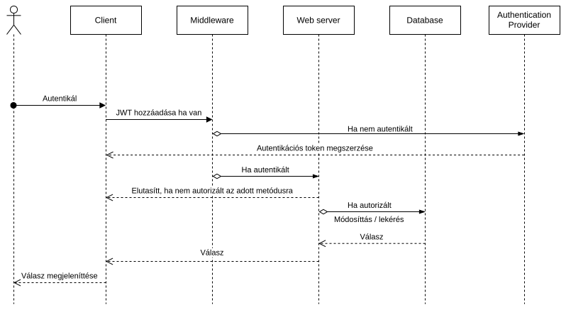

- A kliens elküldi a kérést a szervernek.
- Ha a kliens már be van jelentkeztetve (JWT), akkor a kérést megkapja a szerver.
- Ha a kliens nincs bejelentkezve, akkor a szerver áttirányítja a bejelentkezési oldalra, amely majd bejelentkezés után vissza irányítja a klienst a kívánt oldalra.
- A bejelentkezés részletei provider üggőek, az ábra az Azure Authentikációt mutatja be.
- Ha a kliens bejelentkezve van, akkor a szerver ellenőrzi, hogy a kliens jogosult-e a kérésre. Ha nem akkor elutasítja a kérést.
  > Ez úgy valósíttható meg, hogy a JWT tartalmazza a felhasználó azonosítóját, és a szerver ezt ellenőrzi (mondjuk az adatbázisban tárolt jogosultságokkal).
- Ha minden rendben van, akkor a szerver a kérést végrehajtja, és a választ visszaküldi a kliensnek.

### Form interakciók

Egy adat mósoíttásának, vagy hozzáadásának folyamata

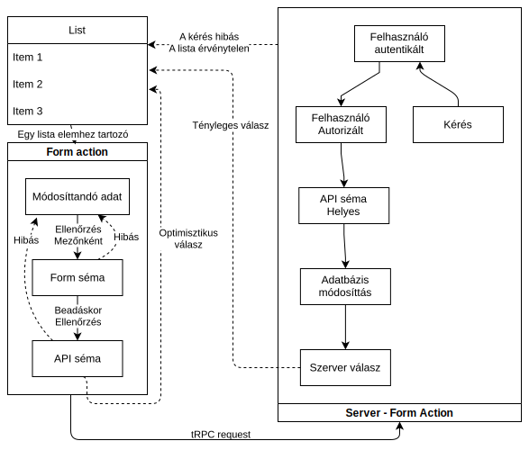

- A felhasználó elkezdi szerkeszteni az egyik adatot.
- Ammennyiben a módosíttás hibás, akár a kliens alapján, akár a szerver alapján, akkor a hibaüzenetet megjelenítjük.
- A kliens alapján a hibát a mezőnél jelenítjük meg, a szerver alapján a hibaüzenetet a form tetején.
- A szerver ellenőrzése a kliensen történik (ez megtehető hiszen a kódbázis ugyan az)
- Ha a kliens oldalon minden rendben van, akkor a szerverhez küldjük a módosíttást és optimisztikusan, úgy tekintjük, hogy a módosíttás sikeres volt.
- A szerver ellenőrzi, hogy a felhasználó jogosult-e a módosíttásra, ha nem egyből hibát küld vissza.
- A szerver ellenőrzi a módosíttást, és ha minden rendben van, akkor a módosíttást végrehajtja. Majd a módosíttott adatot vagy hibát visszaküldi a kliensnek.
- A kliens a válasz alapján frissíti a megjelenített adatokat.

### Listázás folyamata

Az applikáció egyik leggyakrabban használt funkciója a listázás, ezért ezt a folyamatot is érdemes külön megvizsgálni, hiszen a listázás optimális megvalósítása bonyolult folyamat.

\pagebreak
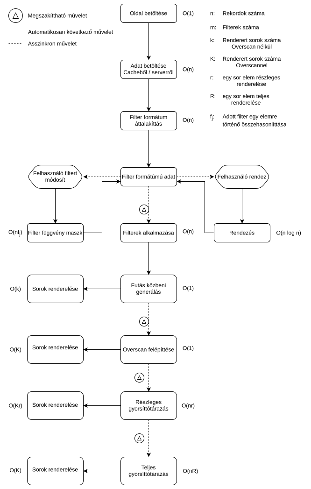
\pagebreak

A listázás folyamata a következő:
A listázás egy teljes mértékben kliens oldali folyamat.

- Az adatokat lekérjük a szerverről, majd egyből le is mentjük a gyorsíttótárba.
- Az adatokat áttalíkítjuk olyan formába, hogy a filterelés a lehető leggyorsabb legyen.
  > minden rekordhoz hozzátesszük a filterelés eredményét is, úgy, hogy, ha a `j` edik filter alapján az adat nem elfogadott, akkor egy maszkban, a maszk `j` edik bitje 0, egyébként 1.
  > Így egy filter módosíttása O(n) és a teljes filter kiszámmítása is O(n) az O(n \* filterek_száma) helyett.
- Rendezés esetén a teljes listát rendezzük egy stabil rendezéssel, így elérhető a többszörös rendezés is.

**Adatok kijelzése**

Az adatok kijelzése, betöltéskor, filter vagy rendezés változásakor történik, így gyorsnak kell lennie.

- Filter módosíttása esetén a kliens várakozik egy rövid időt, hogy a felhasználó befejezze a gépelést(debounce), újra futtatjuk az adatok kijelzését.

- A rendezés esetén az újrafuttatás azonnali.

- A filterek számítta után az optimizációs lépések megszakítthatóak, ha a felhasználó újra módosíttja a filtereket.

- Egyből a kijelzés után a kliens dinamikusan betölti, csak a látható elemeket, ezeket az elemeket a kliens futás közben készítti, majd beszúrja a DOM-ba.

- Egy kis idő elteltével, ha nem volt megszaakítás, akkor a kliens növeli a betöltött elemek számát(overscan), így görgetés esetén ritkábban fog előfordulni, hogy az elem éppen töltődik be.

- További idő elteltével, ha nem volt megszakítás, akkor a kliens elmenti az összes eleme egy részének Node reprezentációját.

- Toavábbi idő elteltével, ha nem volt megszakítás, akkor a kliens elmenti az összes elem teljes Node reprezentációját.

#### A listázás sebességének asszimpotikus vizsgálata

A fenti ábrából kiindulva, a listázás sebességét az alábbi módon vizsgálhatjuk:

| Esemény                   | Első megjeleníttés komplexitása | Görgetés (1 elemre) Komplexitása |
| ------------------------- | ------------------------------- | -------------------------------- |
| betöltéskor               | O(N(n) + n + kR)                | O(R)                             |
| filtereléskor             | O(nf_j + n + kR)                | O(R)                             |
| rendezéskor               | O(n\*log(n) + KR)               | O(R)                             |
| kis idő elteltével 1.     | O(n \* r)                       | O(r)                             |
| még kis idő elteltével 2. | O(n \* R)                       | O(1)                             |

### Oldalon interakciók

Egy megjeleníttő oldalon a felhasználó interakciók által kiváltott események

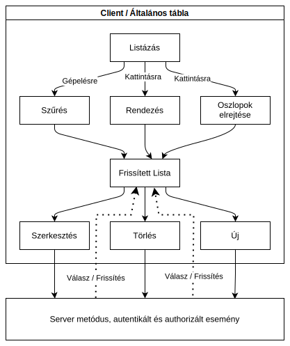

\pagebreak

# A szoftver architektúra terve

## Az adatbázis

Az adatbázis tervezésekor a következő szempontokat vettük figyelembe:

- A lehető legkevesebb redundancia, viszont a használat alatt különböző workaroundokhoz bekerültek redundáns / aggregált adatok.

- Az adatbázis a cég tulajdona így a sémáját mósosíttani a dolgozatomnak nem része, azonban amint a régi megoldásokat átültetjük az új rendszerbe, a redundáns adatokat tartalmazó mezőket eltávolítjuk.

- Az adatbázist Azure Ms SQL valósítja meg, viszont ezt az adatbázis ORM elfedi, és lehetővé teszi bármely más adatbázis használatát is a későbbiekben, a kód módosítása nélkül.

- Az adatbázit **entity-relationship diagrammal** modelleztük, így ezzel is lessz bemutatva

### CompOffice Database

> Generated by [`prisma-markdown`](https://github.com/samchon/prisma-markdown)

- [Banking](#banking)
- [General](#general)
- [Order](#order)
- [Instructor](#instructor)
- [Invoice](#invoice)
- [Services](#services)

#### Banking

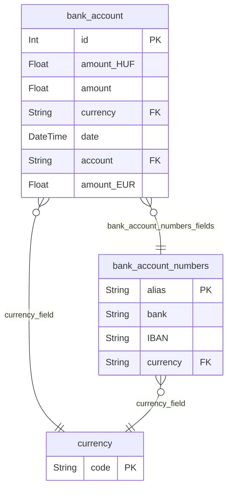

##### `bank_account`

Banki fiókok egy adott időpontokban lévő állapota

Power BI reportok és kimutatások készítéséhez szükséges adatok

A (`data`, `account`) páros egyedi

**Properties**

- `id`: Elsődleges kulcs
- `amount_HUF`: A bank számla egyenlege forintban
- `amount`: A bank számla egyenlege a `currency` valutában
- `currency`
  > A számla valutája
  >
  > A [currency](#currency) tábla [code](#code) oszlopában felsoorolt valuták közül
- `date`: A számla egyenlegéhez tartozó időpont
- `account`: A számla azonosítója
- `amount_EUR`: A számla egyenlege euróban

##### `bank_account_numbers`

Banki fiókok

Power BI reportok és kimutatások készítéséhez szükséges adatok

A (`bank`, `currency`) páros egyedi

**Properties**

- `alias`
  > Elsődleges kulcs
  >
  > A számla azonosítója
- `bank`: A számlát vezető bank neve
- `IBAN`: A számlához tartozó IBAN szám
- `currency`: A számla valutája

#### General

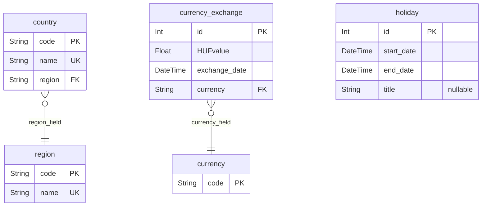

##### `country`

Országok

**Properties**

- `code`
  > Elsődleges kulcs
  >
  > Ország kódja
- `name`: Ország neve
- `region`: Ország régiója

##### `currency`

Elfogadott Valuták

**Properties**

- `code`
  > Elsődleges kulcs
  >
  > Valuta kódja

##### `currency_exchange`

Valuta árfolyamok az adott időpontban (Cache)

A (`exchange_date`, `currency`) páros egyedi

**Properties**

- `id`: Elsődleges kulcs
- `HUFvalue`: Egységnyi valuta értéke forintban
- `exchange_date`: Az árfolyam érvényessége
- `currency`: Az árfolyam valutája

##### `holiday`

Cég szintű szabadságok

**Properties**

- `id`: Elsődleges kulcs
- `start_date`: Szabadság kezdete
- `end_date`: Szabadság vége
- `title`: Szabadság megnevezése

##### `region`

Régiók

Régió mint nagyobb földrajzi egység Például közép-európa

A `name` mező egyedi

**Properties**

- `code`
  > Elsődleges kulcs
  >
  > A régió kódja
- `name`: A régió neve

#### Order

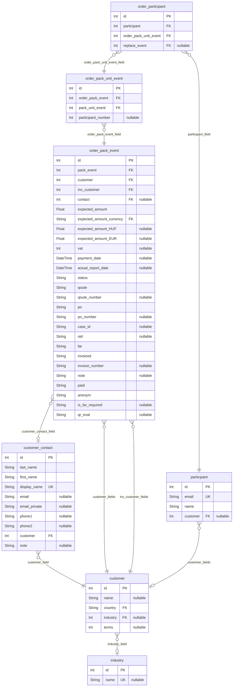

##### `customer`

Ügyfelek

A képzési rendszerben szereplő ügyfelek / cégek adatai

A (`name`, `country`) páros egyedi

**Properties**

- `id`: Elsődleges kulcs
- `name`: Ügyfél neve
- `country`: Ügyfél országa / székhelye
- `industry`
  > Az ügyfél tevékenységi köre
  >
  > Meghatározza, hogy milyen iparágban tevékenykedik az ügyfél a [industry.id](#industry) táblában szereplő iparágak közül
- `terms`: Fizetési határidő

##### `customer_contact`

Kapcsolattartók

**Properties**

- `id`: Elsődleges kulcs
- `last_name`: Kapcsolattartó vezetékneve
- `first_name`: Kapcsolattartó keresztneve
- `display_name`: Kapcsolattartó neve
- `email`: Kapcsolattartó (publikus) email címe
- `email_private`: Kapcsolattartó (privát) email címe
- `phone1`: Kapcsolattartó telefonszáma
- `phone2`: Kapcsolattartó másodlagos telefonszáma
- `customer`: A kapcsolattaró munkahelye
- `note`: Egyéb megjegyzés

##### `industry`

Ügyfelek tevékenységi köre

**Properties**

- `id`: Elsődleges kulcs
- `name`: Az iparág neve

##### `order_pack_event`

Adott projekthez tartozó megrendelések

**Properties**

- `id`: Elsődleges kulcs
- `pack_event`: A projekt azonosítója
- `customer`:
- `inv_customer`: A számlázandó cég azonosítója
- `contact`: Az ügyfél kapcsolattartójának azonosítója
- `expected_amount`
  > A megrendelésből származó várható összeg
  >
  > A várható összeg a `expected_amount_currency` valutában van megadva
- `expected_amount_currency`: A várható összeg valutája
- `expected_amount_HUF`: A várható összeg áttszámolva forintba
- `expected_amount_EUR`: A várható összeg áttszámolva euróba
- `vat`: ÁFA mértéke
- `payment_date`: Kifizetési időpontja
- `actual_report_date`: Rendelés időpontja (Kimutatásokhoz)
- `status`
  > A rendelés státusza
  >
  > A megrendelés lehet:
  >
  > - Tervezett LEAD
  > - Informális INFOR
  > - Megrendelt OR
  > - Befejezett FIN
  > - Törölt CA
- `qoute`: Van e hozzá kapcsolódó ajánlat
- `qoute_number`: Árajánlat
- `po`: PO státusza
- `po_number`: PO száma
- `case_id`: Case száma
- `oid`: Offer száma
- `far`: FAR státusza
- `invoiced`: számlázás státusza
- `invoice_number`: Számla száma
- `note`: Megjegyzés
- `paid`: Kifizetés státusza
- `anonym`: Adott-e a résztvevők email címe
- `is_far_required`: FAR szükséges-e
- `qr_eval`: QR

##### `order_pack_unit_event`

Egy projekthez tartozó megrendelési tétel

A megrendelt tétel a projekt kurzusának egy részletét jelenti
Például egy Kubernetes kurzus egy rész egy Docker bevezető képzés

**Properties**

- `id`: Elsődleges kulcs
- `order_pack_event`: A megrendelés azonosítója
- `pack_unit_event`: A megrendelt tétel azonosítója
- `participant_number`: A megrendelében szereplő résztvevők száma

##### `order_participant`

A megrendelésben szereplő résztvevők

**Properties**

- `id`: Elsődleges kulcs
- `participant`: Résztvevő azonosítója
- `order_pack_unit_event`: A megrendelt tétel azonosítója
- `replace_event`
  > Csere esemény azonosítója
  >
  > Amennyiben a résztvevő nem tud részt venni a kurzuson, akkor a csere esemény azonosítója kerül ide

##### `participant`

Ügyfelek

**Properties**

- `id`: Elsődleges kulcs
- `email`: Az ügyfél email címe (Ide kapják meg a kurzus információkat és az írott tananyagot)
- `name`: Az ügyfél neve
- `customer`: Az ügyfél jelenlegi cégének azonosítója

#### Instructor

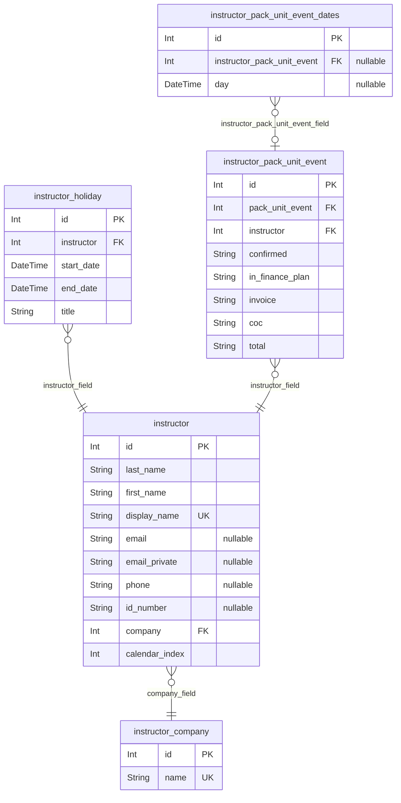

##### `instructor`

Oktatók

**Properties**

- `id`: Elsődleges kulcs
- `last_name`: Oktató vezetékneve
- `first_name`: Oktató keresztneve
- `display_name`: Oktató neve
- `email`: Oktató (publikus) email címe
- `email_private`: Oktató (privát) email címe
- `phone`: Oktató telefonszáma
- `id_number`: Oktató személyi igazolvány száma
- `company`: Az oktató cégének azonosítója
- `calendar_index`: Az oktató sorszáma a Naptárban

##### `instructor_company`

Oktatók cégének adatai

A `name` egyedi

**Properties**

- `id`: Elsődleges kulcs
- `name`: Cég neve

##### `instructor_holiday`

Oktatók tervezett szabadságai

A (`instructor`, `start_date`) páros egyedi

**Properties**

- `id`: Elsődleges kulcs
- `instructor`: Oktató azonosítója
- `start_date`: Szabadság kezdete
- `end_date`: Szabadság vége
- `title`: Szabadság megnevezése

##### `instructor_pack_unit_event`

Oktatók rendelései

Az oktató által tartott megrendelésekhez az oktatóhoz tartozó adatok

A (`pack_unit_event`, `instructor`) páros egyedi

**Properties**

- `id`: Elsődleges kulcs
- `pack_unit_event`: Egy projeckt egy kurzusának azonosítója
- `instructor`: Az oktató azonosítója
- `confirmed`: Az oktató visszaigazolta-e a rendelést
- `in_finance_plan`: Az oktatásért kapott díj fel van-e számolva
- `invoice`: Az oktatásért kapott díj számlázva van-e
- `coc`: Az oktatásért kapott díj teljesítve van-e
- `total`: Az oktató a kurzus teljes időtartama alatt részt vesz-e

##### `instructor_pack_unit_event_dates`

Oktatók rendelésének időpontjai

Amennyiben oktató nem a teljes időtartamra vesz részt egy kurzuson, akkor az időpontokat itt rögzítjük

**Properties**

- `id`: Elsődleges kulcs
- `instructor_pack_unit_event`: Az oktató megrendelésének azonosítója
- `day`: A kurzus egy napja melyen az oktató részt vesz

#### Invoice

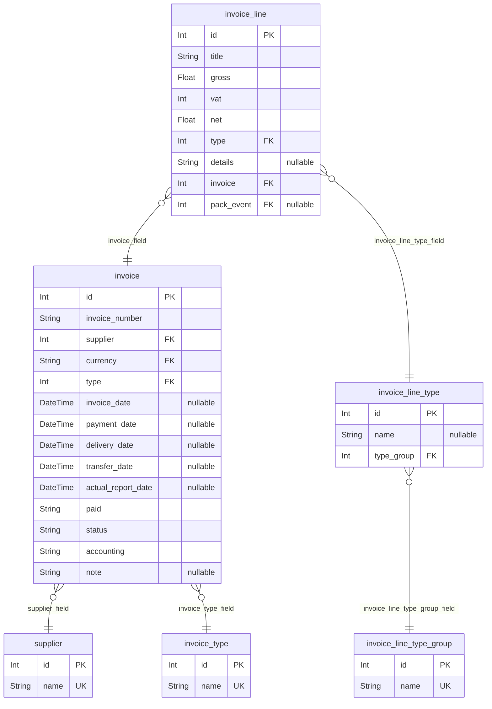

##### `invoice`

Számlák

**Properties**

- `id`: Elsődleges kulcs
- `invoice_number`: Számla száma
- `supplier`: A számla kiállítójának azonosítója
- `currency`: A számla valutája
- `type`: Számla típusának azonosítója
- `invoice_date`: Számlázás dátuma
- `payment_date`: Kifizetés dátuma
- `delivery_date`: Beérkezés dátuma
- `transfer_date`: Átutalás dátuma
- `actual_report_date`: Időpont a kumutatásokhoz
- `paid`: Kifizetés státusza
- `status`: Számla státusza (valós, tervezett)
- `accounting`: Könyvelt vagy sem
- `note`: Megjegyzés

##### `invoice_line`

Számla sorok

A számla sorok a számlákhoz tartozó tételek

**Properties**

- `id`: Elsődleges kulcs
- `title`: A tétel megnevezése
- `gross`: Bruttó összeg
- `vat`: ÁFA (százalékban)
- `net`: Nettó összeg
- `type`: Tétel típusának azonosítója
- `details`: Egyéb részletek
- `invoice`: A számla azonosítója
- `pack_event`: A Projekt azonosítója

##### `invoice_line_type`

Számla tétel típusok

A (`name`, `type_group`) páros egyedi

**Properties**

- `id`: Elsődleges kulcs
- `name`: Tétel megnevezése
- `type_group`: Tétel csoportja

##### `invoice_line_type_group`

Számla tétel csoportok

**Properties**

- `id`: Elsődleges kulcs
- `name`: Csoport megnevezése

##### `invoice_type`

Számla típusok

**Properties**

- `id`: Elsődleges kulcs
- `name`: Típus megnevezése

##### `supplier`

A számlát kiállító entitások

A `name` mező egyedi

**Properties**

- `id`: Elsődleges kulcs
- `name`: A számla kiállítójának neve

#### Services

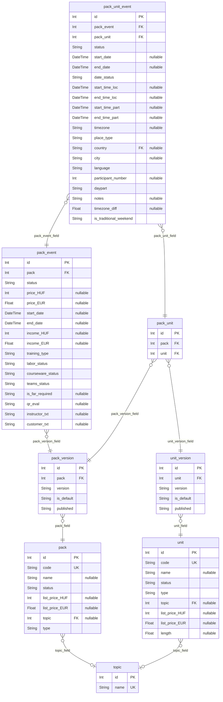

##### `pack`

Csomag

Egy csomag egy kurzus amely több modulból / képzésből áll

**Properties**

- `id`: Elsődleges kulcs
- `code`: A csomag kódja
- `name`: A csomag neve
- `status`
  > A csomag státusza
  >
  > A csomag lehet:
  >
  > - Aktív A
  > - Inaktív I
- `list_price_HUF`: A csomag lista ára forintban
- `list_price_EUR`: A csomag lista ára euróban
- `topic`
  > A csomag téma azonosítója
  >
  > A csomag témája a [topic.id](#topic) táblában szereplő témák közül kerül ki
- `type`
  > A csomag típusa
  >
  > A csomag lehet:
  >
  > - Képzés T
  > - Szupport S
  > - Konzultáció C

##### `pack_event`

Projekt

Egy meghirdetett, megrendelhető kurzus

**Properties**

- `id`: Elsődleges kulcs
- `pack`: A Kurzus azonosítója
- `status`
  > A Projekt státusza
  >
  > A projekt lehet:
  >
  > - folyamatban PR
  > - befejezett CL
  > - törölt CA
- `price_HUF`: A projekt ára forintban
- `price_EUR`: A projekt ára euróban
- `start_date`: A projekt kezdő dátuma
- `end_date`: A projekt befejező dátuma
- `income_HUF`: A projektből származó bevétel forintban
- `income_EUR`: A projektből származó bevétel euróban
- `training_type`
  > A projekt típusa
  >
  > A projekt lehet:
  >
  > - Mindenki számára nyílt képzés OPEN
  > - Zárt csoportos képzés CL
  > - Csak az írott tananyagot tartalmazó képzés CW
- `labor_status`: Az automatikus laborkörnyezet kiépítésének státusza
- `courseware_status`: Az automatikus tananyag kiküldés státusza
- `teams_status`: Az automatikus teams csoportok létrehozása és felvételek státusza
- `is_far_required`: FAR szükséges-e
- `qr_eval`: QR
- `instructor_txt`
  > Az oktató neve
  >
  > Több oktató esetén "Több oktató"
- `customer_txt`
  > A megrendelő cég neve
  >
  > Több cég esetén "Több cég"

##### `pack_unit`

Csomagok felépítése (Kapcsoló tábla)

Megadja, hogy egy csomag melyik kurzusokból áll

A (`pack`, `unit`) páros egyedi

**Properties**

- `id`: Elsődleges kulcs
- `pack`: A csomag megfelelő verziójának azonosítója
- `unit`: A modul megfelelő verziójának azonosítója

##### `pack_unit_event`

Egy projekthez tartozó modul

**Properties**

- `id`: Elsődleges kulcs
- `pack_event`: A Projekt azonosítója
- `pack_unit`: A Csomag és a modul azonosítója
- `status`
  > A modul státusza
  >
  > A modul lehet:
  >
  > - folyamatban PR
  > - befejezett CL
  > - törölt CA
- `start_date`: A modul kezdő dátuma
- `end_date`: A modul befejező dátuma
- `date_status`
  > Az időpont státusza
  >
  > Az időpont lehet:
  >
  > - hiányzó M
  > - tervezett P
  > - fix F
- `start_time_loc`: A modul kezdő időpontja lokális idő szerint
- `end_time_loc`: A modul befejező időpontja lokális idő szerint
- `start_time_part`: A modul kezdete az adott napokon HH:MM
- `end_time_part`: A modul vége az adott napokon HH:MM
- `timezone`
  > A modul időzónája
  >
  > Az oktatás ehhez az időzónához igazodik
- `place_type`
  > A helyszín típusa
  >
  > A helyszín lehet:
  >
  > - Online On
  > - Az oktató cégnél Com
  > - Ügyfélnél Cu
- `country`: Az oktatás országa (ha az oktatás helyszíne az ügyfél cégénél van)
- `city`: Az oktatás városa (ha az oktatás helyszíne az ügyfél cégénél van)
- `language`: Az oktatás nyelve
- `participant_number`: Az oktatásra jelentkezett résztvevők száma
- `daypart`: Félnapos oktatás esetén a naprész (AM, PM, FULL)
- `notes`: Megjegyzések
- `timezone_diff`: Az időzóna különbsége a magyar időzónához képest
- `is_traditional_weekend`: Az oktatandó ügyfelek a Szombat - Vasárnapot tekintik hétvégeknek

##### `pack_version`

Csomagok verziói

Egy csomagnak létehzet több verziója
Ezekhez különböző laborkörnyezet és tananyag is tartozhat

A (`pack`, `version`) páros egyedi

**Properties**

- `id`: Elsődleges kulcs
- `pack`: A csomag azonosítója
- `version`: A csomag verziója
- `is_default`
  > Az alapértelmezett verzió
  >
  > Amennyiben több verzió is létezik, akkor az alapértelmezett verzió az amelyiket ajánljuk, az újabb projekteket tipikusan ezzel a verzióval hozzuk létre
- `published`: publikálva van-e, ha nem akkor vagy megszűnt vagy fejlesztés alatt van

##### `topic`

Képzési témák

A `name` mező egyedi

**Properties**

- `id`: Elsődleges kulcs
- `name`: A téma megnevezése

##### `unit`

Modulok

Egy modul egy önmagában is oktatható képzési egység

**Properties**

- `id`: Elsődleges kulcs
- `code`: A modul kódja
- `name`: A modul neve
- `status`
  > A modul státusza
  >
  > A modul lehet:
  >
  > - Aktív A
  > - Inaktív I
- `type`
  > A modul típusa
  >
  > A modul lehet:
  >
  > - Képzés T
  > - Szupport S
  > - Konzultáció C
- `topic`
  > A modul témája
  >
  > A modul témája a [topic.id](#topic) táblában szereplő témák közül kerül ki
- `list_price_HUF`: A modul lista ára forintban
- `list_price_EUR`: A modul lista ára euróban
- `length`: A modul időtartama (napokban)

##### `unit_version`

Modulok verziói

Egy modulnak létezhet több verziója
Ezekhez különböző laborkörnyezet és tananyag is tartozhat

A (`unit`, `version`) páros egyedi

**Properties**

- `id`: Elsődleges kulcs
- `unit`: A modul azonosítója
- `version`: A modul verziója
- `is_default`
  > Az alapértelmezett verzió
  >
  > Amennyiben több verzió is létezik, akkor az alapértelmezett verzió az amelyiket ajánljuk, az újabb projekteket tipikusan ezzel a verzióval hozzuk létre
- `published`: publikálva van-e, ha nem akkor vagy megszűnt vagy fejlesztés alatt van

## Az "üzelti logika"

Az alkalmazás alapja egy egyszerű réteg az addatbázis fölé, ahol a felhasználó egyszerűen tudja kezelni az adatokat, és a felhasználói felületen keresztül tudja azokat módosítani.

**GET**
A szerver oldal így a legtöbb esetben egy-az-egyben visszaadja a táblák tartalmát, általában a kapcsolt táblák tartalmával együtt.

**POST**
A felület minden esetben ellenőrzi az adatbázis megszoríttásait, és a típuson kívül semmi mást, így az adatbázis a "source of truth".

Ennél fogva az üzleti logika nem tartalmaz semmilyen bonyolult számíttást, vagy adat aggregációt, hiszen ha szükséges, akkor ezeket az adatbázisban valósítjuk meg.

Habár van pár plusz funkció, amely nem a felettébb leírt módon műkködik, ezek a következők:

- A felhasználó bejelentkeztetése
- A felhasználó jogosultságainak ellenőrzése
- Automatikus emailek küldése
- A kalendárhoz szükséges adatok felépíttése
  > Ez nagyon sok számíttás, ezért a nagy részét nem az adatbázis, hanem a szerver valósítja meg.

A szerver oldallal ellentétben a kliens oldal felépíttése sokkal bonyolultabb, hiszen a felhasználói felületnek sokkal több funkciót kell ellátnia, mint a szerver oldalnak.

A kliens oldalnak fel kell tudni dolgozni effektíven a szerver által küldött adatokat, melyek a teljes táblákat tarttalmazza. Ez a következő okokból történik így:

**Az egyben küldés előnyei:**

- A legtöbb adatunk nem "time-series" adat, így nem éri meg szerver oldalon darabolni és csak részleteket küldeni, mert a kliens oldalon keresés / rendezés esetén más adatokra lesz szükségünk.
- Habár ilyenkor lehetne újabb kérést küldeni a szervernek, azonban ez sokkal lassabb lenne, mint egyszerre az összes adatot elküldeni.
- Egy küldés során client -> server -> db -> server -> client úton megy az adat, ami lassú válaszidőhöz vezet, főként a szerver és a db közötti kapcsolat miatt.
- A teljes tábla elküldése nem jelent nagy terhelést a szerverre, hiszen a legtöbb esetben a táblák mérete nem nagy, és a szerver könnyen tudja ezeket a kéréseket kezelni.
- Ebben az esetben a kliens oldal nem küld network requesteket keresés vagy rendezés esetén, így a felhasználói élmény sokkal jobb lesz.

**Az egyben küldés hátrányai:**

- Az oldal betöltése lassabb lesz, mivel a kliens oldalnak meg kell várnia az összes adatot, mielőtt megjelenítené az oldalt.

> Itt a JSON packet mérete a probléma, amit különböző módszerekkel lehetne csökkenteni, mint például a gzip használata, vagy a felesleges mezők kihagyása vagy teljes serializálás formátumát lecsréletjük Protobuf-ra. Azonban jeleneleg erre nem volt még szükség.
> A táblák mérete miatt ez nem nagy probléma, továbbá, többrétegű cache implementációt használunk, így a kliens oldalnak nem kell minden kérésnél újra lekérnie az adatokat.

- Az adatok módosíttása, esetén le kellene kérni ismételten az adatokat.

> Ezt optimisztikus frissíttéssel megoldhatjuk, úgy hogy a frissítést kliens oldali ellenőrzés után elküldjük a szervernek, de ameddig a válasz nem érkezik meg, addig a kliens oldal már a módosíttott adatokat mutatja(A kliens optimisztikus). És a szerver oldal ilyenkor visszaküldi az új adatot / hibát, és a kliens leköveti a változásokat.

- A kliens oldali gyorsíttótár elavulhat, és ezt nem vesszük észre

> Az oldal betültésekkor a kliens feliratkozik a változásokra, így a kliens értesül a változásokról, és frissíti a gyorsíttótárat. Így a kliens oldal mindig naprakész lesz.
> Ez a gyakorlatban egy web socket ideális esetben, ha nem elérhető akkor valami azonos funkciót "trükk rest api-on keresztül"(pl. long polling).

- A felhasználói élmény érdekében a kliens oldal sem végez darabolást a hagyományos értelemben("pagination"), habár ez nem elvárás, viszont ha megvalósíttjuk naívan, akkor a kliens oldal lassú lesz, a rengeteg DOM elem miatt. És a keresések és rendezések is lassúak lesznek, mivel a DOM manipuláció sok időt vesz igénybe.
  > A teljes tábla megjeleníttése helyett, a domot folyamatosan módosíttjuk úgy hogy csak a látható elemeket töltjük be dinamikusan a DOM-ba.

## A kliens

A kliens oldal az előbbiek alapján egy elég bonyolult rendszer, mely sok különböző folyamatból áll.

Ezeket a folyamatokat a következő pontokban jobban kifejtem

### Hálózati interakciók

Egy általános bármilyen kérés a szerver felé így néz ki:


- A kliens elküldi a kérést a szervernek.
- Ha a kliens már be van jelentkeztetve (JWT), akkor a kérést megkapja a szerver.
- Ha a kliens nincs bejelentkezve, akkor a szerver áttirányítja a bejelentkezési oldalra, amely majd bejelentkezés után vissza irányítja a klienst a kívánt oldalra.
- A bejelentkezés részletei provider üggőek, az ábra az Azure Authentikációt mutatja be.
- Ha a kliens bejelentkezve van, akkor a szerver ellenőrzi, hogy a kliens jogosult-e a kérésre. Ha nem akkor elutasítja a kérést.
  > Ez úgy valósíttható meg, hogy a JWT tartalmazza a felhasználó azonosítóját, és a szerver ezt ellenőrzi (mondjuk az adatbázisban tárolt jogosultságokkal).
- Ha minden rendben van, akkor a szerver a kérést végrehajtja, és a választ visszaküldi a kliensnek.

### Form interakciók

Egy adat mósoíttásának, vagy hozzáadásának folyamata


- A felhasználó elkezdi szerkeszteni az egyik adatot.
- Ammennyiben a módosíttás hibás, akár a kliens alapján, akár a szerver alapján, akkor a hibaüzenetet megjelenítjük.
- A kliens alapján a hibát a mezőnél jelenítjük meg, a szerver alapján a hibaüzenetet a form tetején.
- A szerver ellenőrzése a kliensen történik (ez megtehető hiszen a kódbázis ugyan az)
- Ha a kliens oldalon minden rendben van, akkor a szerverhez küldjük a módosíttást és optimisztikusan, úgy tekintjük, hogy a módosíttás sikeres volt.
- A szerver ellenőrzi, hogy a felhasználó jogosult-e a módosíttásra, ha nem egyből hibát küld vissza.
- A szerver ellenőrzi a módosíttást, és ha minden rendben van, akkor a módosíttást végrehajtja. Majd a módosíttott adatot vagy hibát visszaküldi a kliensnek.
- A kliens a válasz alapján frissíti a megjelenített adatokat.

### Listázás folyamata

Az applikáció egyik leggyakrabban használt funkciója a listázás, ezért ezt a folyamatot is érdemes külön megvizsgálni, hiszen a listázás optimális megvalósítása bonyolult folyamat.

\pagebreak

\pagebreak

A listázás folyamata a következő:
A listázás egy teljes mértékben kliens oldali folyamat.

- Az adatokat lekérjük a szerverről, majd egyből le is mentjük a gyorsíttótárba.
- Az adatokat áttalíkítjuk olyan formába, hogy a filterelés a lehető leggyorsabb legyen.
  > minden rekordhoz hozzátesszük a filterelés eredményét is, úgy, hogy, ha a `j` edik filter alapján az adat nem elfogadott, akkor egy maszkban, a maszk `j` edik bitje 0, egyébként 1.
  > Így egy filter módosíttása O(n) és a teljes filter kiszámmítása is O(n) az O(n \* filterek_száma) helyett.
- Rendezés esetén a teljes listát rendezzük egy stabil rendezéssel, így elérhető a többszörös rendezés is.

**Adatok kijelzése**

Az adatok kijelzése, betöltéskor, filter vagy rendezés változásakor történik, így gyorsnak kell lennie.

- Filter módosíttása esetén a kliens várakozik egy rövid időt, hogy a felhasználó befejezze a gépelést(debounce), újra futtatjuk az adatok kijelzését.

- A rendezés esetén az újrafuttatás azonnali.

- A filterek számítta után az optimizációs lépések megszakítthatóak, ha a felhasználó újra módosíttja a filtereket.

- Egyből a kijelzés után a kliens dinamikusan betölti, csak a látható elemeket, ezeket az elemeket a kliens futás közben készítti, majd beszúrja a DOM-ba.

- Egy kis idő elteltével, ha nem volt megszaakítás, akkor a kliens növeli a betöltött elemek számát(overscan), így görgetés esetén ritkábban fog előfordulni, hogy az elem éppen töltődik be.

- További idő elteltével, ha nem volt megszakítás, akkor a kliens elmenti az összes eleme egy részének Node reprezentációját.

- Toavábbi idő elteltével, ha nem volt megszakítás, akkor a kliens elmenti az összes elem teljes Node reprezentációját.

#### A listázás sebességének asszimpotikus vizsgálata

A fenti ábrából kiindulva, a listázás sebességét az alábbi módon vizsgálhatjuk:

| Esemény                   | Első megjeleníttés komplexitása | Görgetés (1 elemre) Komplexitása |
| ------------------------- | ------------------------------- | -------------------------------- |
| betöltéskor               | O(N(n) + n + kR)                | O(R)                             |
| filtereléskor             | O(nf_j + n + kR)                | O(R)                             |
| rendezéskor               | O(n\*log(n) + KR)               | O(R)                             |
| kis idő elteltével 1.     | O(n \* r)                       | O(r)                             |
| még kis idő elteltével 2. | O(n \* R)                       | O(1)                             |

### Oldalon interakciók

Egy megjeleníttő oldalon a felhasználó interakciók által kiváltott események


## Drótváztervek

### Általános

Az alkalmazásban néhány eset kivételével a felhasználói felület egyszerűsítthető, itt az általános esetet mutatom be, amikor a felhasználó egy listázást néz.

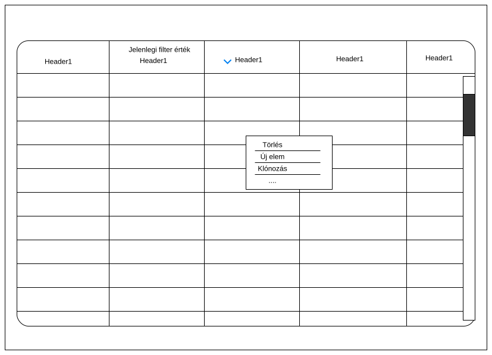

Amikor egy fejléc elemre kattint jobb / bal kattintás

- Egy sorra jobb kattintva, megjelenik egy kontextus menü, ahol a felhasználó tudja módosíttani a sort, vagy törölni azt, klónozni azt, vagy létrehozni egy teljesen újat.

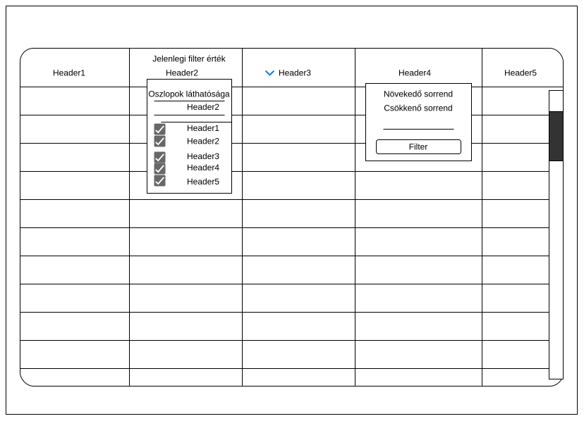

Amikor egy listaelmemre kattint akkor megjelenik a módosíttó form

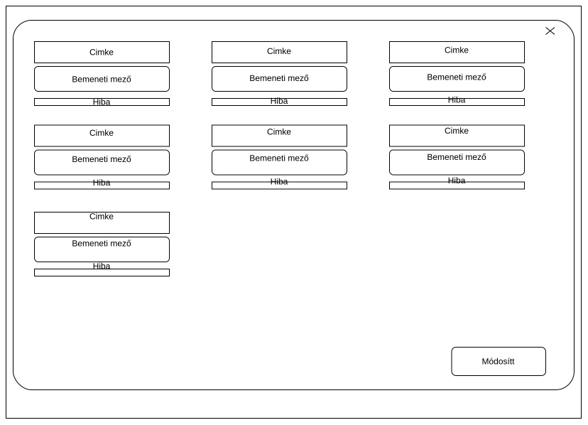

### Kalendár nézet

A kalendár tartalmazza a tanárok órarendjét és az elérhető időintervallumaikat, a tanárok számára ez az egyik legfontosabb funkció.

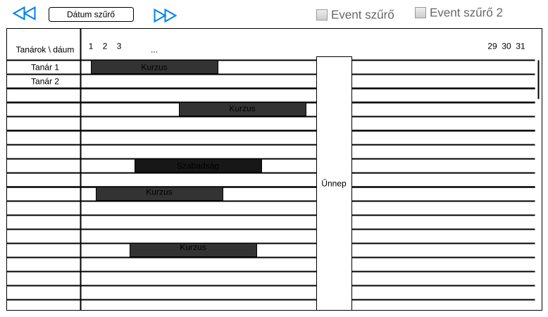
