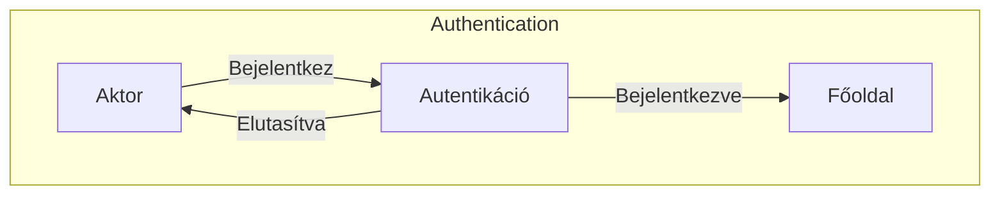
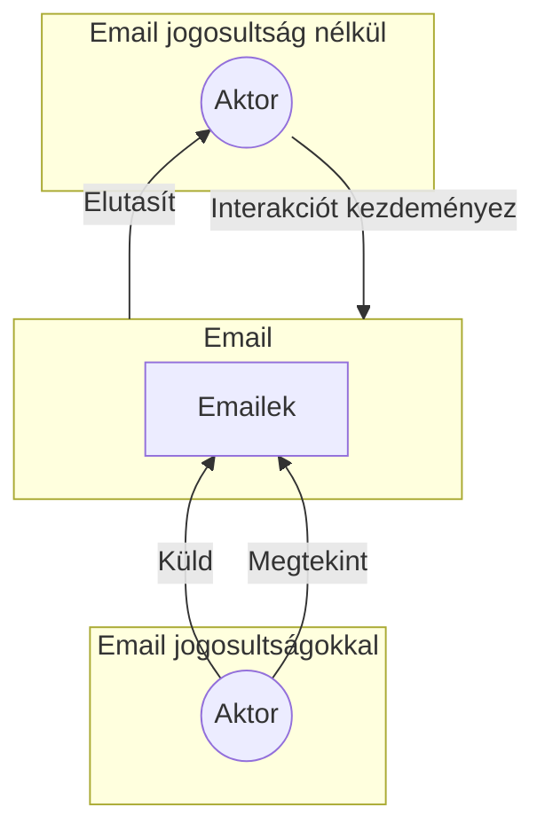
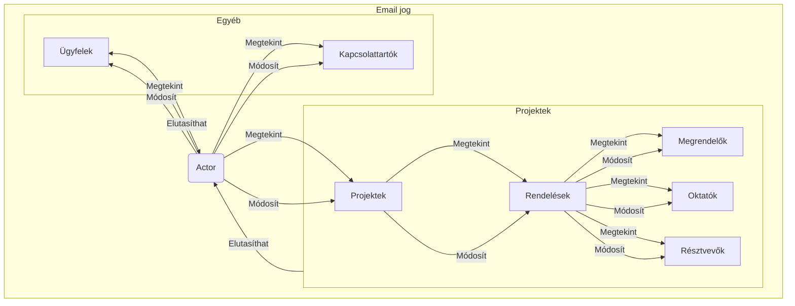
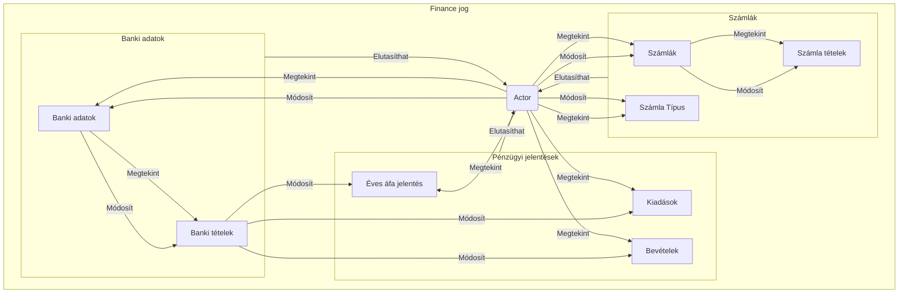
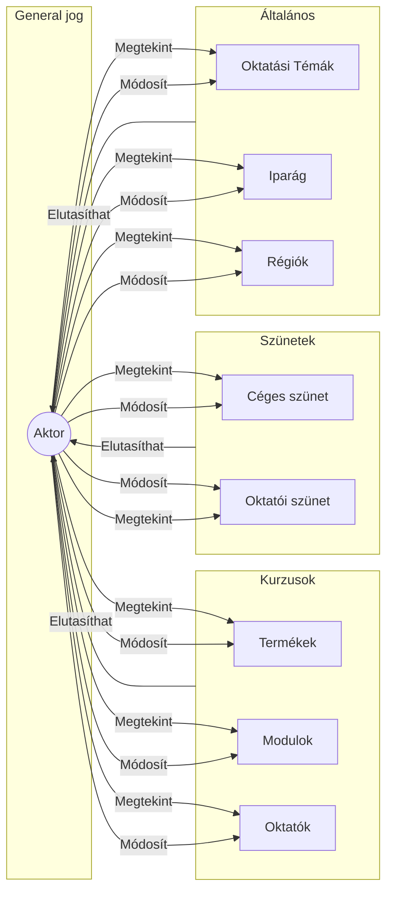
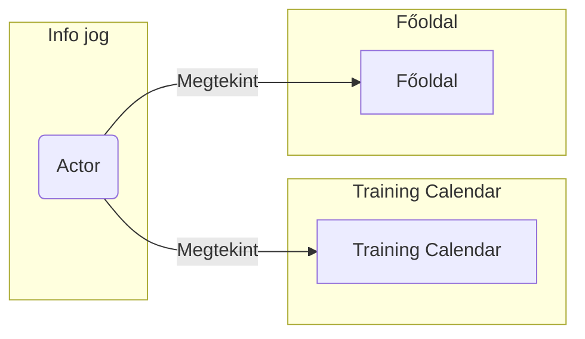

# Szakdolgozat


EÖTVÖS LORÁND TUDOMÁNYEGYETEM
Informatikai Kar
Média- és Oktatás informatikai Tanszék

CompOffice  - Kurzus és pénzügyi adminisztárció

Témavezető:  Dr. Menyhárt László Gábor, egyetemi adjunktus

Szerző: Osztopáni Kristóf, Programtervező informatikus BSC


\pagebreak

# 1. Bevezetés

## 1.1 A dolgozat felépítése

A Szakdolgozat több szekcióra van osztva. Ezeket a címekben és alcímekben megjelenő első szám jelöli.


A szakdolgozat megírása még folymatban van, így egyes részek hiányosak lehetnek.

Egyes szekciók tartalma:

- **1. Bevezetés**: Bemutatom a tervezett alkalmazást nagy vonalakban, szakdolgozat feléptését, az alkalmazás célközönségét valamint a szakdolgozat motivációját.

- **2. Felhasználói dokumentáció**: Az alkalmazás használatát mutatom be, a felhasználói felületet, a menüpontokat, az alkalmazás használatának lépéseit.

- **3. Fejlesztői dokumentáció**: Az alkalmazás fejlesztésének lépéseit mutatom be, a fejlesztés során használt technológiákat, a fejlesztési környezetet, a fejlesztési lépéseket valamint a kész arhitketúrát.


## 1.2 Témabejelentő

> Megjegyzés: A témabejelentőm, nem a szószerinti leadott verzió, de tartalmilag ekvivales


A szakdolgozatom témája egy fullstack alkalmazás fejlesztése, amely egy cég belső adminisztrációját segíti, továbbá a fejlesztést és későbbi támogatást segíttő technológiák felhasználása.

Az alkalmazás célja, hogy gyorsítsa az adminisztrációs folyamatokat, valamint a pénzügyi adatok kezelését. Ezek a folyamatok:

- A modulok(A legkissebb önmagukban is értékesíthető kurzusok) regisztrálása
- A termékek(Több modult tartalmazhat) registrálása
- Projektek (Egy kurzus amit adott időpontban tartunk és megrendelhető) regisztrálása
- A projektekre érkező rendelések céges információinak / részvevők adatainak / a kurzust tartó oktatók adataink rögzíttése, ellenőrzése
- A projektekhez tartozó pénzügyi adatok kezelése
- Általános pénzügyi adatok kezelése

Az alkalmazás érzékeny adatokat kezel így a biztonságra nagy hangsúlyt fektetek. Az alkalmazásban a Microsoft MFA autentikáció és Azure AD alapján a teljes céges okoszisztémában is használt biztonságos bejelentkezés lesz jelen. A biztonság elvárások miatt kiemelten fontos a hogy a lehető legkevesebb bug jusson csak ki a kódbázisból a kész termékbe. Ehhez teljes e2e típusbiztos rendszert alakíttunk ki, ami azt jelenti hogy a kommunikáció az Adatbázistól a szerverhez és a szervertől a klienshez végig típusellenőrízve lehet, amely reményeim szerint csökkenti az előforduló hibák számát. Továbbá a célom egy olyan tesztelési keretrendszer felépíttése amely képes a teljes kódbázist a funkcionális követelmények alapján tesztelni.

Az alkalmazás fejlesztéséhez sok automatikus rendszer is tartozik, a fejelsztői élmény növelése érdekében. Ezeket a fejlesztői dokumentációban részletesen is bemutatom.

A felhasználók számára elérhető lesz egy kalendár és egy dashboard, ahol a tervezet és elműlt megrendeléseket követhetik nyomon, valamint küldhetnek ki emlékezdtetőket és összefoglalókat az oktatóknak az elkövetkező kurzusokról.
Továbbá egy automatikus rendszer emlékezteti az adminisztrátorokat a közelgő eseményekről, hiányzó bejegyzésekről.

Az alkalmazás egy fullstack PWA lesz, amely ahol a szerver és kliens oldalt én valósíttom meg, az adatbázis pedig egy már létező adatbázisra épül, így ennek módosíttása nem része a dolgozatomnak.

Ezt az alkalmazást 3 éve egy LowCode keretrendszerben már megvalósítottam, de ez a megoldés nem volt skálázható, így most egy teljesen új megközelítéssel szeretném megvalósítani.

\pagebreak

# 3. Fejlesztői Dokumentáció

## 3.1 Áttekintés


### 3.1.1 Élő dokumentáció
A dokumentáció nagy része "élő" dokumentációként lett tervezve, ígya dokumentáció nagy része integrált a kódbázisban.

Erre egy példa hogy az adatbázis modelje a `prisma/schema.prisma` file amely leírja a konkrét adatbázis táblákat és kapcsolatokat, képes legenerálni a hozzájuk tartozó entity-relationship diagramot és leírásokat is.
> Megjegyzés: A dokumentáció így "élő" hiszen csak a kód részét kell változtatnom és emiatt frissül a dokumentáció része is a projektnek.


A schema így néz ki:
```
/// @namespace Instructor
/// Oktatók cégének adatai
model instructor_company {
/// Elsődleges kulcs
///
/// @format uuid
id         Int          @id(map: "PK__instruct__3213E83FA0B8D54C")

/// Cég neve
name       String       @unique(map: "UQ__instruct__72E12F1BD9C014F0") @db.VarChar(100)
instructor instructor[]
}
```

És ebből Markdown formátumú dokumentáció készül. A kódbázis minden dokumentációja Markdown formátumú, pontosabban Github Favoured Markdown formátumú, és elérhető a [githubon](https://github.com/Kristofy/CompOffice/blob/master/wiki/wiki.md). Ebből PDF is generálható.

### 3.1.2 Dokumentáció előállítása
A dokumentációs fájlok:

- __/wiki/__: Tartalmazza az öszes dokumentációt.
- __/wiki/wiki.md/__: Az összevont dokumentáció
- __/wiki/docs.md__: A dokumentáció kialakításához használt gyökér fájl.
- __/wiki/dev/__: Tartalmazza a dokumentáció élő részét, ezek a generált dokumentációk.
- __/wiki/content/__: Tartalmazza a dokumentáció statikus részét


A Dokumentáció felépíttése a kódbázisból a következőként történik:

- **1.**: Az adatbázis dokumentációjának legenerálása
- **2.**: A userstory-k dokumentációjának legenerálása
- **3.**: A root fájlt használva egy md-be összevonja a dokumentáció részeit.
- **4.**: Az összevont dokumentációból készítjük a PDF-et.

> A megfelelő környezetben az `npm run docs` parancs ezeket hajtja végre

### 3.1.3 A használt eszközök

- Az adatbázis-t [Prisma](https://www.prisma.io/) Orm-el managelem, és ehhez egy (prisma-markdow)[https://github.com/samchon/prisma-markdown] generátorral készítem a dokumentációt.

- A markdown dokumentációban található [Mermaid](https://github.com/mermaid-js/mermaid) formátumú diagrammokat a [mermaid-filter](https://github.com/raghur/mermaid-filter) cseréli le képre pdf esetén.

- A md-merge-lés egy saját python eszköz amely megtalálható a `/tools/md_merge.py` fileban

- A user-story-k a '/features` mappában találhatóak .feature kiterjesztéssel, ezek egy speciális Markdown formátumot követnek kifejezetten User-story-kra tervezve, a formátumot (Gherkin)[https://cucumber.io/docs/gherkin/reference/]-nek hívják.

- A .features kiterjesztésű user story-k közönséges Markdown-ná alakíttását a [gherkin2markdown](https://github.com/raviqqe/gherkin2markdown) program végzi.

- A végső PDF a [Pandoc](https://pandoc.org/) programmal készül az [eisvogel](https://github.com/enhuiz/eisvogel) template-t használva.


\pagebreak

## 3.2 Nem funkcionális követelmények

### 3.2.1 Hatékonyság

- A gyors válaszidő fontos, de nem priorítás.

- Az alkalmazás ahol tehet nagy mennyiségű adatokat pager-rel jeleníttmeg

- Az adat módisíttás optimisztikus módon történik, azaz ha a kliens oldalon el lett fogadva akkor a kliens folytatja a működésést még mielőtt a szerver válaszolna, a ritka alkalmankét amikor a szerver válasza, hogy helytelen a kliens oldali változás akkor a kliens oldalán is visszaállítja a változást.

- Ammenyiben szükséges egy Gyorsítóttár réteg is bevezethető, az  adatbázis tűlterheltségének csökkentésére. Feltehetően mivel az alkalmazást egyszerre csak 5-10 ember használja, ezért nem lesz szükség rá.

### 3.2.2 Biztonság

- Minden kommunikáció MS MFA Azure AD mögött történik.

- Az ismert támadási technikák (SQL Injection, XSS, stb.)  nem működnek az alkalmazásban.


### 3.2.3 Megbízhatóság

- Az alkalmazás tRPC-t használ a kliens oldalon, de REST stílusú "publikus" api-t is biztosítt. nem vezethet hibás viselkedéshez.

- Minden fontos esemény az alkalmazásban naplózásra kerül.


### 3.2.4 Felhasználói felület

- A felület ergonomikus és könnyen kezelhető.

- A felület kényelmes új felhasználók számára és lehetőséget ad a gyorsabb munkára a tapasztalt felhasználók számára.

- Az alkalmazásnak reszponzívnak kell lennie, azaz minden eszközön jól használhatónak kell lennie, habár az alkalmazás irodai környezetben való munkára (Számítógépen) készül.

### 3.2.5 Platformfüggetlenség

- Az alkalmazás kliens oldala Chromium alapú böngészőkön és Firefoxon működik.

- A server oldal tetszőleges linux szerveren működik.

### 3.2.6 Szükséges erőforrások

**Hardveres erőforrások**:


- Az alkalmazás kliens oldala egy átlagos számítógépen is futtatható.
- Az alkalmazás szerver oldala egy átlagos szerveren is futtatható.
- Fejlesztés alatt a gyors fejlesztéshez egy erősebb számítógép ajánlott 8+ GB rammal és 4+ magos processzorral.

**Szoftveres erőforrások**:


- Az alkalmazás kliens oldala egy átlagos böngészőn futtatható.
- Az alkalmazás szerver oldala egy átlagos linux szerveren futtatható.
- Fejlesztés alatt a package.json-ben devDependencies-ben megadott szoftverek szükségesek, valamint egyéb csomagok ezek:
- git, nodejs, npm, pandoc, go, python3, texlive latex csomagok
- fejlesztői környezet, lehetőleg ami integrálja a formázó és lintelő eszközöket pl.: VSCode vagy nvim
- Adatbázis szerver

**Üzemeltetés és karbantartás**:


- Az karbantartáshoz egy naplózó rendszer beüzemelése előnyös de nem szükséges
- Az üzemeltetés a számítógép költségén kívül nem igényel egyéb költséget.
- A karbantartás egyszerűsíttése a dolgozatom egyik fő célja. Reményeim szerint az erre fordíttandó költéségek minimálisak lesznek.

### 3.2.7 Megvalósíttás és használt technológiák


TBD


\pagebreak

## 3.3 Funkcionális követelmények

A rendszernek a következő funkciókat, reakciókat kell tudnia biztosítani.

> Megjegyzés: Az alkalmazás belső használatra készül így a nyílt webről kereséssel való felfedezéssel nem kell foglalkozni.

### 3.3.1 Általános funkciók

#### A weboldal megnyitása után:

- A felhasználók bejelentkezhetnek, akkor és csak akkor ha Azure AD-ben megenedett felhasználók.
- Ha a felhasználónak még van aktív bejelentkezése, akkor nem szükséges újra bejelentkeznie.
- Egy felhasználóhoz több aktív munkamenet is tartozhat.


#### A weboldal bezárása után:

- Az aktív munkamenet lezárul.


#### A weboldal minden "oldalán":
> Megjegyzés: Az alkalmazás egy PWA tehát nem a hagyományos értelemben vett oldalakról beszélünk

- A felhasználók a menüben tudnak navigálni.
- A felhasználók vissza tudnak lépni a főoldalra.
- A felhasználók tudnak kijelentkezni.
- A felhasználók vissza tudnak lépni a jelenlegi munkamenetben a régebbi oldalra.
- A felhasználó meg tudja nyitni a kalendárt
- Minden listázó oldal frissíthető.
- Minden szerkesztő oldal menthető.
- Ha az éppen szerkesztett rekordot valaki más módosította, akkor a felhasználót értesíteni kell.

\pagebreak

### 3.3.2 Felhasználók

#### 3.3.2.1 Jogosultsági szintek


A rendszerben a következő jogosultsági szinteket különböztetjük meg:

- **Super**: Az alkalmazás teljes körű használatára jogosult, admin felhasználó.

- **Test**: Az alkalmazás teljes körű használatára jogosult, fejlesztő és tesztelő felhasználó.

- **Finance**: A cég pénzügyi adatainak kezelésére jogosult felhasználó.

- **Operator**: A cég üzemi adatainak kezelésére jogosult felhasználó.

- **Coordinator**: (Legacy) Az Operátor felhasználókkal ekvivalens jogosultságú felhasználó.

> Kezdetben különbözőek jogosultságokkal rendelkeztek de a kialakulás alatt a kért változások miatt a végeredményben ugyanazok a jogosultságokkal rendelkeznek, de különböző embereknek vannak kiosztva.

- **Instructor**: A cég egy belső oktatója, főként a felvitt project adatok ellenőrzésére jogosult.

- **Support**: A cég egy külsős oktatója, a jogosultságai az Instructor felhasználóéval jelenleg megegyeznek.

- **Bot**: Az automatikus rendszerekhez szükséges legszűkebb jogosultságú felhasználó / service account.


#### 3.3.2.2 Jogosultsági körök


Az alkalmazásban elvégezhető műveleteket a következő csoportokba lehet beosztani:

- **Email**: Az emlékeztető és értesítő levelek küldése

- **Info**: A Dashboard és a Kalendár megtekintése

- **Order**: A rendelések kezelése és új projectek kiírása

- **Finance**: A pénzügyi adatok kezelése, a banki backlogok kezelése

- **General**: Általános adatok kezelése


Ezek a csoportok tartalma megtekinthető az Adatbázis leírásában

Továbbá a jogosultságok megvalósíttásakkor a jogosultsági körök minden oldalra külön felülírhatóak lesznek.


#### 3.3.2.3 Műveletek


A jogosultsági körök által meghatározott műveletek a következők lehetnek:

- **Read**(R): Adatok megtekintése

- **Write**(W): Adatok módosítása

- **Restricted**(-): Az adott adatokhoz nincs hozzáférés


| Jogosultságok \ Körök         | Super | Test | Finance | Operator | Coordinator | Instructor | Support |
|-------------------------------|-------|------|---------|----------|-------------|------------|---------|
| Email                         |  W    |  W   |   -     |    W     |     W       |     -      |    -    |
| Info                          |  W    |  W   |   W     |    W     |     W       |     R      |    R    |
| Order                         |  W    |  W   |   W     |    W     |     W       |     R      |    R    |
| Finance                       |  W    |  W   |   W     |    -     |     -       |     -      |    -    |
| General                       |  W    |  W   |   W     |    W     |     W       |     R      |    R    |


#### 3.3.2.4 Vendég jogosultságok


Minden adat érzékeny így nem engedünk vendég felhasználót, kizárólag a Céges Azure AD-ban meghatározott felhasználók látogathatják az oldalt

\pagebreak

### 3.3.3 Use-case diagramok

#### 3.3.3.1 As An **Un Authenticated User**.
\
Bejelentkezési oldal látogatásakkor a felhasználó, ha még nem jelentkezett be, akkor a bejelentkezési oldalra irányítódik át, ahonnan sikeres bejelentkezés után a főoldalra irányítódik át, sikeretelen bejelentkezés esetén a bejelentkezési oldalon marad.





\pagebreak

#### 3.3.3.2 As An **Authenticated User** With **Email** privileges.

\

Amennyiben egy felhasználó rendelkezik az email(W) jogosultsággal akkor az alábbi funkciókat tudja elérni:

- Küldhet emailt

- Megtekintheti az emailküldés státuszát

Ha csak olvasó jogosultsága van akkor csak megtekintésre nyithatja meg, amennyiben nincs jogosultsága, akkor nem tudja megnyitni az oldalt, a menüfülön nem is lesz látható az opció.




\pagebreak


#### 3.3.3.3 As An **Authenticated User** With **Order** privileges.
\
A felhasználó meg tudja tekinteni a futó projektekt és annak minden részletét beleértve a megrenelőket és a megrendelők résztvevőit, valamit a projektet tartó oktatókat. Ezen felül képes az ügyfeleket és kapcsolattartók adatait módosíttani.

- Módosíttás csak akkor ha van W jogosultsága

- Megtekintés csak akkor ha Olvasás(vagy írás) jogosultsága van.

- Ha nincs jogosultsága akkor nem tudja megnyitni az oldalt, a menüfülön nem is lesz látható az opció, ha a felhasználó mégis oda navigál akkor az oldal elutasítja a kérést.




\pagebreak

#### 3.3.3.4 As An **Authenticated User** With **Finance** privileges.
\
A felhasználó hozzáfér a pénzügyi adatokhoz és azokat módosíthatja is.
A pézügyi adatok közé tartozik a költségek, bevételek, banki adatok, számlák és számla tételek, valamint az áfa jelentések.

- Módosíttás csak akkor ha van W jogosultsága

- Megtekintés csak akkor ha Olvasás(vagy írás) jogosultsága van.

- Ha nincs jogosultsága akkor nem tudja megnyitni az oldalt, a menüfülön nem is lesz látható az opció, ha a felhasználó mégis oda navigál akkor az oldal elutasítja a kérést.




\pagebreak

#### 3.3.3.5 As An **Authenticated User** With **General** privileges.
\
A felhasználó hozzáfér az általános adatokhoz.
Az általános adatok közé tartozik a modulok, termékek, oktatók, céges szünetek, oktatási témák, iparágak és régiók.

- Módosíttás csak akkor ha van W jogosultsága

- Megtekintés csak akkor ha Olvasás(vagy írás) jogosultsága van.

- Ha nincs jogosultsága akkor nem tudja megnyitni az oldalt, a menüfülön nem is lesz látható az opció, ha a felhasználó mégis oda navigál akkor az oldal elutasítja a kérést.




\pagebreak

#### As An **Authenticated User** With **Info** privileges.
\
Minden felhasználó rendelkezik az Info jogosultsággal.

Az Info jogosultság csak megtekintésre jogosítja fel a felhasználót.

A Felhasználó megtekintheti a Training Calendár és a Főoldalon a közeljövőben esedékes eseményeket.





\pagebreak

### 3.3.4 User-Story-k

\footnotesize

### A felhasználó be tud lépni az alkalmazásba


**A felhasználó bejelentkezik**

_Given_ A felhasználó fiókja Azure AD-ben megengedett

_When_ Oldal látogatása

_Then_ Automatikus bejelentkeztetés.


**A felhasználó nem jelentkezhet be**

_Given_ A felhasználó fiókja Azure AD-ben nem megengedett

_When_ Oldal látogatása

_Then_ Az oldal visszautasítja a bejelentkezést.


**A bejelentkezett felhasználó a főoldalra kerül**

_Given_ A felhasználó bejelentkezett

_When_ Oldal látogatása

_Then_ A főoldalra kerül.


**A bejelentkezett felhasználó kijelentkezik**

_Given_ A felhasználó bejelentkezett

_When_ Kijelentkezés

_Then_ A bejelentkező oldalra kerül.


**A felhasználónak megfeleő jogosultságai vannak**

_Given_ A felhasználó bejelentkezett

_When_ Oldal látogatása

_Then_ A felhasználó megfelelő jogosultságokkal rendelkezik.


### Általános műveletek nem lehetségesek a megfelelő jogosultság nélkü


**Az oldal nem tölt be adatot, és hibát ad, ha a felhasználó megfelelő jogosultság nélkül látogat egy oldalt**

_Given_ A felhasználó bejelentkezett

_When_ A oldal látogatása AND A felhasználónak nincs megtekintés jogosultsága az A oldalhoz

_Then_ Az oldal nem tölt be adatot, és hibát ad.


**Az oldalakon nem módosíthat jogosultság nélkül**

_Given_ A felhasználó bejelentkezett

_When_ A oldal látogatása AND A felhasználónak nincs módosítás jogosultsága az A oldalhoz

_Then_ Az oldalakon nem módosíthat.


**Az oldalakon nem törölhet jogosultság nélkül**

_Given_ A felhasználó bejelentkezett

_When_ A oldal látogatása AND A felhasználónak nincs törlés jogosultsága az A oldalhoz

_Then_ Az oldalakon nem törölhet.


**Az oldalakon nem hozzáadhat jogosultság nélkül**

_Given_ A felhasználó bejelentkezett

_When_ A oldal látogatása AND A felhasználónak nincs hozzáadás jogosultsága az A oldalhoz

_Then_ Az oldalakon nem hozzáadhat.


**Törlés esetén mindig mergerősíttést kérünk**

_Given_ A felhasználó bejelentkezett

_When_ A törlés ikonra kattint

_Then_ Törlés esetén mindig mergerősíttést kérünk.


### Visszalépés


**A felhasználó visszalép az előző oldalra**

_Given_ A felhasználó bejelentkezett AND Egy tetszőleges A oldalt majd B oldalt meglátogatott

_When_ A felhasználó visszalép

_Then_ A felhasználó az előző A oldalra kerül.


### Projekt oldal


**A felhasználó meglátogathatja a projekt oldalt**

_Given_ A felhasználó bejelentkezett

_When_ A felhasználónak van jogosultsága megtekinteni a projekt oldalt

_Then_ A projekt oldal betölt.


**A projekt oldalon a megfelelő adatok jelennek meg**

_Given_ A projekt oldal betölt

_Then_ A Projekt oldalon a megfelelő adatok jelennek meg.


**A törlés ikonok megfelelően működnek**

_Given_ A projekt oldal betölt

_When_ felhasználónak van jogosultsága módosítani a projekt oldalon

_Then_ A törlés ikon megjelenik minden projekt mellett.


**A törlés ikonra kattintva a projekt törlődik**

_Given_ A projekt oldal betölt

_When_ felhasználó törölni próbál egy projektet

_Then_ A projekt törlődik, minden hozzá tartozó adattal együtt.


**A felhasználónak nincs jogosultsága módosíttani a projekt oldalon**

_Given_ A projekt oldal betölt

_When_ A felhasználónak nincs jogosultsága módosíttani a projekt oldalon

_Then_ A projekt oldalon törlés ikon nem jelenik meg.


**A szűrők megfelelően működnek, üres állapotból indulnak**

_Given_ A projekt oldal betölt

_Then_ A szűrők megfelelően működnek, üres állapotból indulnak.


**Projektek kiválaszthatóak, és ezek megjelennek részletesen**

_Given_ A projekt oldal betölt

_When_ A felhasználó kiválaszt egy projektet

_Then_ A projekt részletesen megjelenik.


**Összesített oldal megfelelő adatokat jelenítt meg**

_Given_ A projekt részletesen megjelenik

_When_ A felhasználó kiválasztja az összesített oldalt

_Then_ A összesített oldal megfelelő adatokat jelenítt meg.


**Modulok oldal megfelelő adatokat jelenítt meg**

_Given_ A projekt részletesen megjelenik

_When_ A felhasználó kiválasztja a modulok oldalt

_Then_ A modulok oldal megfelelő adatokat jelenítt meg.


**A Rendelések oldal megfelelő adatokat jelenítt meg**

_Given_ A projekt részletesen megjelenik

_When_ A felhasználó kiválasztja a rendelések oldalt

_Then_ A rendelések oldal megfelelő adatokat jelenítt meg.


**A felhasználó klónoz egy projectet**

_Given_ A felhasználó kiválasztja az összesített oldalt AND felhasználónak van jogosultsága módosítani a projekt oldalon

_When_ A felhasználó a klónozás ikonra kattint

_Then_ A projekt klónozása lehetséges.


**Egységes módosíttás**

_Given_ A felhasználó kiválasztja az összesített oldalt AND felhasználónak van jogosultsága módosítani a projekt oldalon

_When_ A felhasználó a módosítás ikonra kattint

_Then_ A projekt moduljai egyszerre módosíthatóak.


**Megrendelés törlése**

_Given_ A felhasználó kiválasztja a rendelések oldalt AND felhasználónak van jogosultsága módosítani a projekt oldalon

_When_ A felhasználó a törlés ikonra kattint

_Then_ A rendelés törlése lehetséges.


**Megrendelés módosíttása**

_Given_ A felhasználó kiválasztja a rendelések oldalt AND felhasználónak van jogosultsága módosítani a projekt oldalon

_When_ A felhasználó a módosítás ikonra kattint

_Then_ A rendelés módosíttása lehetséges.


**A Modulok törlése lehetséges**

_Given_ A felhasználó kiválasztja a modulok oldalt AND felhasználónak van jogosultsága módosítani a projekt oldalon

_When_ A felhasználó a törlés ikonra kattint

_Then_ A modulok törlése lehetséges.


**A Modulok módosíttása lehetséges**

_Given_ A felhasználó kiválasztja a modulok oldalt AND felhasználónak van jogosultsága módosítani a projekt oldalon

_When_ A felhasználó a módosítás ikonra kattint

_Then_ A modulok módosíttása lehetséges.


**Order hozzáadássa lehetséges**

_Given_ A felhasználó kiválasztja a rendelések oldalt AND felhasználónak van jogosultsága módosítani a projekt oldalon

_When_ A felhasználó a rendelés hozzáadás ikonra kattint

_Then_ A rendelés hozzáadása lehetséges.


**Modul hozzáadássa lehetséges**

_Given_ A felhasználó kiválasztja a modulok oldalt AND felhasználónak van jogosultsága módosítani a projekt oldalon AND a kiválasztott projektnek még nincs minden modulja hozzáadva

_When_ A felhasználó a modul hozzáadás ikonra kattint

_Then_ A modul hozzáadása lehetséges.


**Új projekt hozzáadássa lehetséges**

_Given_ A felhasználó kiválasztja a projekt oldalt AND felhasználónak van jogosultsága módosítani a projekt oldalon

_When_ A felhasználó a projekt hozzáadás ikonra kattint

_Then_ A projekt hozzáadása lehetséges.


### A navigációs sáv a helyes adatokat tartalmazza és megfelelően funkcionál


**A navigációs sáv betölt**

_Given_ A felhasználó bejelentkezett

_When_ Oldal látogatása

_Then_ A navigációs sáv betölt.


**A navigációs sáv a megfelelő adatokat tartalmazza**

_Given_ A felhasználó bejelentkezett

_When_ Oldal látogatása

_Then_ A navigációs sáv a felhasználó nevét és a számára elérhető oldalakat tartalmazza.


**A felhasználó a Home ikonra kattintva a főoldalra kerül**

_Given_ A felhasználó bejelentkezett

_When_ Home ikonra kattint

_Then_ A főoldalra kerül.


**A felhasználó a Training Calendar ikonra kattintva a Training Calendar oldalra kerül**

_Given_ A felhasználó bejelentkezett

_When_ Training Calendar ikonra kattint

_Then_ A Training Calendar oldalra kerül.

### A főoldal megfelelően betölt


**A főoldalon megjelennek a jövőbeli események**

_Given_ A felhasználó bejelentkezett

_When_ Főoldal látogatása

_Then_ A főoldalon megjelennek a jövőbeli események.


**A jelenlegi hét inforációi töltenekbe**

_Given_ A felhasználó bejelentkezett

_When_ Főoldal látogatása

_Then_ A főoldal a jelenlegi hét információit tartalmazza.


**A főoldalon a hetek között navigálva az információ helyesen frissül**

_Given_ A felhasználó bejelentkezett

_When_ Főoldal látogatása

_Then_ A főoldalon a hetek között navigálva az információ helyesen frissül.

### Training Kalendár


**A training kalendár megfelelően betölt**

_Given_ A felhasználó bejelentkezett

_When_ Training Kalendár látogatása

_Then_ A Training Kalendár betölt.


**A training kalendár navigálásra megfelelően frissül**

_Given_ A felhasználó bejelentkezett

_When_ A Training Kalendár betölt

_Then_ A Training Kalendár navigálásra megfelelően frissül.


**A training kalendár a jelenlegi hónapról indul**

_Given_ A felhasználó bejelentkezett

_When_ A Training Kalendár betölt

_Then_ A Training Kalendár a jelenlegi hónapról indul.


### Modulok oldal


**A felhasználó meglátogathatja a modulok oldalt**

_Given_ A felhasználó bejelentkezett

_When_ A felhasználónak van jogosultsága megtekinteni a modulok oldalt

_Then_ A modulok oldal betölt.


**A Szűrők megfelelően működnek, üres állapotból indulnak**

_Given_ A modulok oldal betölt

_Then_ A szűrők megfelelően működnek, üres állapotból indulnak.


**A kijelölt modul részletesen megjelenik**

_Given_ A modulok oldal betölt

_When_ A felhasználó kiválaszt egy modult

_Then_ A kijelölt modul részletesen megjelenik.


**Modulok módosíttása**

_Given_ A modulok oldal betölt AND felhasználónak van jogosultsága módosítani a modulok oldalon

_When_ A felhasználó a módosítás ikonra kattint

_Then_ A modulok módosíttása lehetséges.


**Modulok hozzáadássa lehetséges**

_Given_ A modulok oldal betölt AND felhasználónak van jogosultsága módosítani a modulok oldalon

_When_ A felhasználó a modul hozzáadás ikonra kattint

_Then_ A modul hozzáadása lehetséges.

### Product oldal


**A felhasználó meglátogathatja a product oldalt**

_Given_ A felhasználó bejelentkezett

_When_ A felhasználónak van jogosultsága megtekinteni a product oldalt

_Then_ A product oldal betölt.


**A szűrők megfelelően működnek, üres állapotból indulnak**

_Given_ A product oldal betölt

_Then_ A szűrők megfelelően működnek, üres állapotból indulnak.


**A kijelölt product részletesen megjelenik**

_Given_ A product oldal betölt

_When_ A felhasználó kiválaszt egy productet

_Then_ A kijelölt product részletesen megjelenik a hozzáadott modulokkal együtt.


**A product módosíttása lehetséges**

_Given_ A product oldal betölt AND felhasználónak van jogosultsága módosítani a product oldalon

_When_ A felhasználó a módosítás ikonra kattint

_Then_ A product módosíttása lehetséges.


**Product hozzáadássa lehetséges**

_Given_ A product oldal betölt AND felhasználónak van jogosultsága módosítani a product oldalon

_When_ A felhasználó a product hozzáadás ikonra kattint

_Then_ A product hozzáadása lehetséges.


### BankAccount oldal


**A felhasználó meglátogathatja a bankaccount oldalt**

_Given_ A felhasználó bejelentkezett

_When_ A felhasználónak van jogosultsága megtekinteni a bankaccount oldalt

_Then_ A bankaccount oldal betölt.


**A szűrők megfelelően működnek, üres állapotból indulnak**

_Given_ A bankaccount oldal betölt

_Then_ A szűrők megfelelően működnek, üres állapotból indulnak.


**Megjelenik a backlog**

_Given_ A bankaccount oldal betölt

_Then_ Megjelenik a backlog.


**Megjelenik a backlog aggregálása per nap**

_Given_ A bankaccount oldal betölt

_Then_ Megjelenik a backlog aggregálása per nap.


**A backlog módosíttása lehetséges**

_Given_ A bankaccount oldal betölt AND felhasználónak van jogosultsága módosítani a bankaccount oldalon

_When_ A felhasználó a módosítás ikonra kattint

_Then_ A backlog módosíttása lehetséges.


**Backlog hozzáadássa lehetséges**

_Given_ A bankaccount oldal betölt AND felhasználónak van jogosultsága módosítani a bankaccount oldalon

_When_ A felhasználó a backlog hozzáadás ikonra kattint

_Then_ A backlog hozzáadása lehetséges.

### CashFlow oldal


**A felhasználó meglátogathatja a cashflow oldalt**

_Given_ A felhasználó bejelentkezett

_When_ A felhasználónak van jogosultsága megtekinteni a cashflow oldalt

_Then_ A cashflow oldal betölt.


**A szűrők megfelelően működnek, üres állapotból indulnak**

_Given_ A cashflow oldal betölt

_Then_ A szűrők megfelelően működnek, üres állapotból indulnak.


**A CacheFlow oldal megfelelően aggregálja az adatokat és jelenitti meg a kiadásokat és bevételeket**

_Given_ A cashflow oldal betölt

_Then_ A CacheFlow oldal megfelelően aggregálja az adatokat és jelenitti meg a kiadásokat és bevételeket.

### ÁfaReport oldal


**A felhasználó meglátogathatja az áfareport oldalt**

_Given_ A felhasználó bejelentkezett

_When_ A felhasználónak van jogosultsága megtekinteni az áfareport oldalt

_Then_ Az áfareport oldal betölt.


**A szűrők megfelelően működnek, üres állapotból indulnak**

_Given_ Az áfareport oldal betölt

_Then_ A szűrők megfelelően működnek, üres állapotból indulnak.


**Az áfareport oldal megfelelően aggregálja az adatokat és jelenitti meg az intervallumon összegzett áfa rétéket**

_Given_ Az áfareport oldal betölt

_Then_ Az áfareport oldal megfelelően aggregálja az adatokat és jelenitti meg teljes áfa érétéket.


### Számlák oldal


**A felhasználó meglátogathatja a számlák oldalt**

_Given_ A felhasználó bejelentkezett

_When_ A felhasználónak van jogosultsága megtekinteni a számlák oldalt

_Then_ A számlák oldal betölt.


**A szűrők megfelelően működnek, üres állapotból indulnak**

_Given_ A számlák oldal betölt

_Then_ A szűrők megfelelően működnek, üres állapotból indulnak.


**Elérhető 3 féle presen a sűrők gyors állítására**

_Given_ A számlák oldal betölt

_Then_ Elérhető 3 féle presen a sűrők gyors állítására.


**A kijelölt számla részletesen megjelenik**

_Given_ A számlák oldal betölt

_When_ A felhasználó kiválaszt egy számlát

_Then_ A kijelölt számla részletesen megjelenik a számla tételeivel együtt.


**A számla módosíttása lehetséges**

_Given_ A számlák oldal betölt AND felhasználónak van jogosultsága módosítani a számla oldalon

_When_ A felhasználó a módosítás ikonra kattint

_Then_ A számla módosíttása lehetséges.


**Számla hozzáadássa lehetséges**

_Given_ A számlák oldal betölt AND felhasználónak van jogosultsága módosítani a számla oldalon

_When_ A felhasználó a számla hozzáadás ikonra kattint

_Then_ A számla hozzáadása lehetséges.


**Számla törlése lehetséges**

_Given_ A számlák oldal betölt AND felhasználónak van jogosultsága módosítani a számla oldalon

_When_ A felhasználó a törlés ikonra kattint

_Then_ A számla törlése lehetséges.


**Számla Tétel törlése lehetséges**

_Given_ A számlák oldal betölt AND felhasználónak van jogosultsága módosítani a számla oldalon

_When_ A felhasználó a törlés ikonra kattint

_Then_ A számla törlése lehetséges.


**Számla Tétel hozzáadássa lehetséges**

_Given_ A számlák oldal betölt AND felhasználónak van jogosultsága módosítani a számla oldalon

_When_ A felhasználó a hozzáadás ikonra kattint

_Then_ A számla hozzáadása lehetséges.


**Számla Tétel módosíttása lehetséges**

_Given_ A számlák oldal betölt AND felhasználónak van jogosultsága módosítani a számla oldalon

_When_ A felhasználó a módosítás ikonra kattint

_Then_ A számla módosíttása lehetséges.


**Számla klónozása lehetséges**

_Given_ A számlák oldal betölt AND felhasználónak van jogosultsága módosítani a számla oldalon

_When_ A felhasználó a klónozás ikonra kattint

_Then_ A számla klónozása lehetséges.


### Oktatók oldal


**A felhasználó meglátogathatja az oktatók oldalt**

_Given_ A felhasználó bejelentkezett

_When_ A felhasználónak van jogosultsága megtekinteni az oktatók oldalt

_Then_ Az oktatók oldal betölt.


**A szűrők megfelelően működnek, üres állapotból indulnak**

_Given_ Az oktatók oldal betölt

_Then_ A szűrők megfelelően működnek, üres állapotból indulnak.


**Az oktató módosíttása lehetséges**

_Given_ Az oktatók oldal betölt AND felhasználónak van jogosultsága módosítani az oktató oldalon

_When_ A felhasználó a módosítás ikonra kattint

_Then_ Az oktató módosíttása lehetséges.


**Oktató hozzáadássa lehetséges**

_Given_ Az oktatók oldal betölt AND felhasználónak van jogosultsága módosítani az oktató oldalon

_When_ A felhasználó a oktató hozzáadás ikonra kattint

_Then_ Az oktató hozzáadása lehetséges.


**A kijelölt oktató részletesen megjelenik**

_Given_ Az oktatók oldal betölt

_When_ A felhasználó kiválaszt egy oktatót

_Then_ A kijelölt oktató részletesen megjelenik.

### Suppliers oldal


**A felhasználó meglátogathatja a suppliers oldalt**

_Given_ A felhasználó bejelentkezett

_When_ A felhasználónak van jogosultsága megtekinteni a suppliers oldalt

_Then_ A suppliers oldal betölt.


**A kijelölt supplier részletesen megjelenik**

_Given_ A suppliers oldal betölt

_When_ A felhasználó kiválaszt egy supplieret

_Then_ A kijelölt supplier részletesen megjelenik.


**A supplier módosíttása lehetséges**

_Given_ A suppliers oldal betölt AND felhasználónak van jogosultsága módosítani a supplier oldalon

_When_ A felhasználó a módosítás ikonra kattint

_Then_ A supplier módosíttása lehetséges.


**Supplier hozzáadássa lehetséges**

_Given_ A suppliers oldal betölt AND felhasználónak van jogosultsága módosítani a supplier oldalon

_When_ A felhasználó a supplier hozzáadás ikonra kattint

_Then_ A supplier hozzáadása lehetséges.

### Kapcsolattartók oldal


**A felhasználó meglátogathatja a kapcsolattartók oldalt**

_Given_ A felhasználó bejelentkezett

_When_ A felhasználónak van jogosultsága megtekinteni a kapcsolattartók oldalt

_Then_ A kapcsolattartók oldal betölt.


**A szűrők megfelelően működnek, üres állapotból indulnak**

_Given_ A kapcsolattartók oldal betölt

_Then_ A szűrők megfelelően működnek, üres állapotból indulnak.


**A kijelölt kapcsolattartó részletesen megjelenik**

_Given_ A kapcsolattartók oldal betölt

_When_ A felhasználó kiválaszt egy kapcsolattartót

_Then_ A kijelölt kapcsolattartó részletesen megjelenik.


**A kapcsolattartó módosíttása lehetséges**

_Given_ A kapcsolattartók oldal betölt AND felhasználónak van jogosultsága módosítani a kapcsolattartó oldalon

_When_ A felhasználó a módosítás ikonra kattint

_Then_ A kapcsolattartó módosíttása lehetséges.


**Kapcsolattartó hozzáadássa lehetséges**

_Given_ A kapcsolattartók oldal betölt AND felhasználónak van jogosultsága módosítani a kapcsolattartó oldalon

_When_ A felhasználó a kapcsolattartó hozzáadás ikonra kattint

_Then_ A kapcsolattartó hozzáadása lehetséges.

### Résztvevők oldal


**A felhasználó meglátogathatja a résztvevők oldalt**

_Given_ A felhasználó bejelentkezett

_When_ A felhasználónak van jogosultsága megtekinteni a résztvevők oldalt

_Then_ A résztvevők oldal betölt.


**A szűrők megfelelően működnek, üres állapotból indulnak**

_Given_ A résztvevők oldal betölt

_Then_ A szűrők megfelelően működnek, üres állapotból indulnak.


**A résztvevő módosíttása lehetséges**

_Given_ A résztvevők oldal betölt AND felhasználónak van jogosultsága módosítani a résztvevő oldalon

_When_ A felhasználó a módosítás ikonra kattint

_Then_ A résztvevő módosíttása lehetséges.


**Résztvevő hozzáadássa lehetséges**

_Given_ A résztvevők oldal betölt AND felhasználónak van jogosultsága módosítani a résztvevő oldalon

_When_ A felhasználó a résztvevő hozzáadás ikonra kattint

_Then_ A résztvevő hozzáadása lehetséges.


**Több részvevő importálása excel file-ból**

_Given_ A résztvevők oldal betölt AND felhasználónak van jogosultsága módosítani a résztvevő oldalon

_When_ A felhasználó a importálás ikonra kattint

_Then_ Több részvevő importálása lehetséges.

### Ügyfél oldal


**A felhasználó meglátogathatja az ügyfél oldalt**

_Given_ A felhasználó bejelentkezett

_When_ A felhasználónak van jogosultsága megtekinteni az ügyfél oldalt

_Then_ Az ügyfél oldal betölt.


**A szűrők megfelelően működnek, üres állapotból indulnak**

_Given_ Az ügyfél oldal betölt

_Then_ A szűrők megfelelően működnek, üres állapotból indulnak.


**Az ügyfél módosíttása lehetséges**

_Given_ Az ügyfél oldal betölt AND felhasználónak van jogosultsága módosítani az ügyfél oldalon

_When_ A felhasználó a módosítás ikonra kattint

_Then_ Az ügyfél módosíttása lehetséges.


**Ügyfél hozzáadássa lehetséges**

_Given_ Az ügyfél oldal betölt AND felhasználónak van jogosultsága módosítani az ügyfél oldalon

_When_ A felhasználó a ügyfél hozzáadás ikonra kattint

_Then_ Az ügyfél hozzáadása lehetséges.

### A Core data alá tartozó (Holidays, Instructor, InvoiceLineType, Topics, Industries) oldalakon megfejelő jogosultság melett lehetséges a törlés és módosíttás


**A felhasználó meglátogathatja a CoreData oldalakon**

_Given_ A felhasználó bejelentkezett

_When_ A felhasználónak van jogosultsága megtekinteni a CoreData oldalt

_Then_ A megfelelő CoreData oldal betölt.


**A megfelelő CoreData oldalon a törlés lehetséges**

_Given_ A megfelelő CoreData oldal betölt AND A megfelelő CoreData oldal betölt

_When_ A felhasználó a törlés ikonra kattint

_Then_ A törlés lehetséges.


**A megfelelő CoreData oldalon a módosíttás lehetséges**

_Given_ A megfelelő CoreData oldal betölt AND A megfelelő CoreData oldal betölt

_When_ A felhasználó a módosítás ikonra kattint

_Then_ A módosíttás lehetséges.


**A megfelelő CoreData oldalon a hozzáadás lehetséges**

_Given_ A megfelelő CoreData oldal betölt AND A megfelelő CoreData oldal betölt

_When_ A felhasználó a hozzáadás ikonra kattint

_Then_ A hozzáadás lehetséges.


### Email oldal


**A felhasználó meglátogathatja az email oldalt**

_Given_ A felhasználó bejelentkezett

_When_ A felhasználónak van jogosultsága megtekinteni az email oldalt

_Then_ Az email oldal betölt.


**A szűrők megfelelően működnek, üres állapotból indulnak**

_Given_ Az email oldal betölt

_Then_ A szűrők megfelelően működnek, üres állapotból indulnak.


**Az email-ek automatikusan legenerálódnak**

_Given_ Az email oldal betölt

_When_ A felhasználó a generálás ikonra kattint

_Then_ Az email-ek automatikusan legenerálódnak.


**Az email-eket egyesével lehetséges módosíttani**

_Given_ Az email-ek automatikusan legenerálódnak

_Then_ Az email-eket egyesével lehetséges módosíttani.


**Az emaileknél bejelölhető hogy ne legyenek elküldve**

_Given_ Az email-ek automatikusan legenerálódnak

_Then_ Az emaileknél bejelölhető hogy ne legyenek elküldve.


**Az email-eket áttnézését követően az emailek egy gombnyomásra kiküldhetőek és  ezekről azonnali visszajelzés van**

_Given_ Az email-ek automatikusan legenerálódnak

_When_ A felhasználó a kiküldés ikonra kattint

_Then_ Az email-eket áttnézését követően az emailek egy gombnyomásra kiküldhetőek és  ezekről azonnali visszajelzés van.


**Az email kiküldés egy összesíttést küld a céges @support email-re**

_Given_ Az email-ek automatikusan legenerálódnak

_When_ A felhasználó a kiküldés ikonra kattint

_Then_ Az email kiküldés egy összesíttést küld a céges @support email-re.


### Szerkesztő oldalak


**A szerkesztő oldalakra navigálva megjelenítés jogosultsággal nem teszi lehetővé az adatok módosíttását csupán megtekintését**

_Given_ A felhasználó bejelentkezett

_When_ A felhasználónak van jogosultsága megtekinteni a szerkesztő oldalon AND A felhasználónak nincs jogosultsága módosítani a szerkesztő oldalon

_Then_ A szerkesztő oldal betölt, de a módosíttás nem lehetséges.


**Új adat hozzáadása lehetséges**

_Given_ A felhasználó bejelentkezett AND A felhasználónak van jogosultsága módosítani a szerkesztő oldalon

_When_ A felhasználó a hozzáadás ikonra kattint

_Then_ Új adat hozzáadása lehetséges.


**Szerkesztés lehetséges**

_Given_ A felhasználó bejelentkezett AND A felhasználónak van jogosultsága módosítani a szerkesztő oldalon

_When_ A felhasználó a módosítás ikonra kattint

_Then_ Szerkesztés lehetséges.


**Módosíttás lehetséges**

_Given_ Új adat hozzáadása lehetséges OR Szerkesztés lehetséges

_Then_ Módosíttás lehetséges.


**Egy mező módosíttása tartja az adatbázis megszorításait**

_Given_ Módosíttás lehetséges

_When_ A felhasználó módosítja a mezőt

_Then_ Az adatbázis megszoríttásai a kliens oldalon ellenőrzésre kerülnek.


**Módosíttás után invalid mező jelzése**

_Given_ Módosíttás lehetséges

_When_ A felhasználó módosítja a mezőt

_Then_ Az invalid mező jelzése megjelenik, hibaüzenettel.


**A mentés csak akkor lehetséges ha minden mező valid**

_Given_ Módosíttás lehetséges

_When_ A felhasználó módosítja a mezőt

_Then_ A mentés csak akkor lehetséges ha minden mező valid.


**A tényleges változások csak a mentés pillanatában érvényesülnek**

_Given_ Módosíttás lehetséges

_When_ A felhasználó módosítja a mezőt

_Then_ A tényleges változások csak a mentés pillanatában érvényesülnek.


**A mentés után az adatok azonnal frissülnek és visszanavigálunk az előző oldalra**

_Given_ Módosíttás lehetséges

_When_ A felhasználó ment

_Then_ A mentés után az adatok azonnal frissülnek és visszanavigálunk az előző oldalra.


**Az igaz / hamis mezők checkbox-ként jelennek meg**

_Given_ Módosíttás lehetséges

_Then_ Az igaz / hamis mezők checkbox-ként jelennek meg.


**A több de véges constrain-t ből származó lehetséges értékek kereshető dropdown-ként jelennek meg**

_Given_ Módosíttás lehetséges

_Then_ A több de véges constrain-t ből származó lehetséges értékek kereshető dropdown-ként jelennek meg.


**Az adatbázis kapcsolatoknak megfelelően, ha egy módosíttás nem egyértelmű változásokat vonna maga után, a felhasználót értesítjük és kérjük megerősítését**

_Given_ Módosíttás lehetséges

_When_ A felhasználó módosítja a mezőt

_Then_ Az adatbázis kapcsolatoknak megfelelően, ha egy módosíttás nem egyértelmű változásokat vonna maga után, a felhasználót értesítjük és kérjük megerősítését.


**A kapcsolt táblák mezői egy jól érthető a másik táblából kinyert értékkel jelennek meg**

_Given_ Módosíttás lehetséges

_Then_ A kapcsolt táblák mezői egy jól érthető a másik táblából kinyert értékkel jelennek meg o.
\normalsize

**A külön nem speficikált részletek**:
\
Ezek a részletek belső megbeszélés során alakultak ki és folyamatosan változnak, ilyenek például a szűrők alépértelmezett beállítása vagy az alapértelmezett redezési kritériumok.

Ezen esetekben a régi projekthez szándékozom feature-parity-t elérni, vagyis a régi projekthez hasonlóan működik majd az új is.


\pagebreak

### Főbb folyamatok


#### Form interakciók


#### Hálózati interakciók


#### Listázás folyamata


#### Oldalon interakciók


\pagebreak
